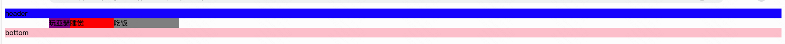
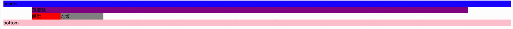
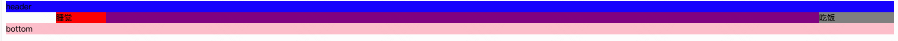
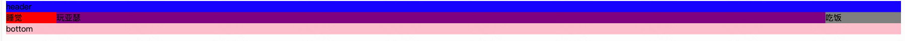

# 八股文

## 一.面试题汇总

### doctype 的意义

- 让浏览器以标准模式渲染
- 让浏览器知道元素的合法性

### HTML/XHTML/HTML5的区别

- HTML 属于SGML
- XHTML属于XML，是HTML进行XML严格化的结果
- HTML5，不属于SGML,也不属于XML,有自己的独立规范，比XHTML宽松

### head标签配置

- 问：网页的head标签里面，表示的是页面的配置，有什么配置？
- 答：字符集、关键词、页面描述、页面标题、IE适配、视口、iPhone小图标等等。

### 超链接属性--跳转

- `href`：目标URL
- `title`：悬停文本。
- `name`：主要用于设置一个锚点的名称。
- `target`：告诉浏览器用什么方式来打开目标页面。`target`属性有以下几个值：
  - `_self`：在同一个网页中显示（默认值）
  - `_blank`：**在新的窗口中打开**。
  - `_parent`：在父窗口中显示
  - `_top`：在顶级窗口中显示

### em 和 i的区别

共同：都表示斜体

区别：

- em是语义化标签，表示强调
- i是纯样式标签，HTML5中不推荐使用

 ###  `<textarea>`标签：多行文本输入框

**属性：**

 - `rows="4"`：指定文本区域的行数。
 - `cols="20"`：指定文本区域的列数。
 - `readonly`：只读。


### HTML5 新变化

- 新的语义化元素
- 表单增强
- 新的API：离线、音视频、图形、本地存储、实时通信、设备能力等

### HTML5新增


### 语义化标签


- `<section>` 表示区块
- `<article>` 表示文章。如文章、评论、帖子、博客
- `<header>` 表示页眉
- `<footer>` 表示页脚
- `<nav>` 表示导航
- `<aside>` 表示侧边栏。如文章的侧栏
- `<figure>` 表示媒介内容分组。
- `<mark>` 表示标记 (用得少)
- `<progress>` 表示进度 (用得少)
- `<time>` 表示日期

### 语义化的意义

- 开发者容易理解，便于维护

- 机器（搜索引擎、读屏软件）容易理解结构

- 有助于SEO （搜索引擎优化）

  SEO:只要设置Description页面描述，那么百度搜索结果，就能够显示这些语句，这个技术叫做**SEO**（search engine optimization，搜索引擎优化）

### meta viewport 是做什么用的，怎么写？

```html
 	<meta name="viewport" content="width=device-width, user-scalable=no, initial-scale=1.0, maximum-scale=1.0, minimum-scale=1.0">
```

控制页面在移动端不要缩小显示。

### 伪类和伪元素的区别

概念上：

- 伪类表示一种**状态**
- 伪元素是**真的有元素**。比如 ::after 是真的有元素，可以在页面上显示内容。

使用上：

- 伪类：使用单冒号

- 伪元素：使用双冒号

### 页面解析渲染

页面解析渲染：


HTML解释器，解析HTML，生成DOM树；

CSS解释器，解析样式表，生成样式规则，CSSOM树；

在解析步骤中创建的 CSSOM 树和 DOM 树组合成一个 Render 树，

Layout：Render 树用于计算每个可见元素的布局属性，位置，大小。

Painting：然后将其绘制到屏幕上。

### 关于CSS和JS阻塞解析

- 遇到 JS 链接时，会调用请求，异步获取资源。

  JS可能会修改DOM树和CSSOM树，造成回流和重绘，由此阻塞DOM树的构建

- CSS不会阻塞解析过程；

### 处理script和css style的顺序

- 运行到script时，文档解析会暂停，知道脚本执行完毕 

  设置defer属性，会在文档解析后执行脚本

- 样式表不会改变DOM树，所以不会停止文档解析

### web 存储 sessionStorage和localStorage

H5有两种存储方式：

1. Window.sessionStorage 会话存储：

- 保存在内存中
- 浏览器窗口关闭时，数据销毁
- 在同一个窗口下数据可以共享

2. Window.localStorage 本地存储

- 保存在浏览器内存里或者硬盘里
- 永久生效，除非手动删除
- 可以多窗口共享

常见API

设置存储内容：

```javascript
	setItem(key, value);
```

PS：可以新增一个 item，也可以更新一个 item。

读取存储内容：

```javascript
	getItem(key);
```

根据键，删除存储内容：

```javascript
	removeItem(key);
```


清空所有存储内容：

```javascript
	clear();
```

根据索引值来获取存储内容：


```javascript
	key(n);
```

### 可以自闭合的元素

- 表单input
- 图片 img
- br hr
- meta link

### form表单的作用

- 直接提交表单
- 使用submit、reset按钮
- 便于浏览器保存表单
- 第三方库可以整体获取值
- 第三方库可以进行表单验证

### 选择器优先级

-  id 选择器
-  类选择器、属性选择器、伪类选择器
-  标签选择器、伪元素选择器

因为对于相同方式的样式表，其选择器排序的优先级为：ID选择器 > 类选择器 > 标签选择器

属性选择器：a[title]  存在 title 属性的<a> 元素

伪类选择器：“ ： ”开头，选择处于特定状态的元素 :last-child  :invalid  :hover

伪元素选择器：“ :: ”开头，表现得是像你往标记文本中加入全新的 HTML 元素一样   

### 行内元素和块级元素区别

行内：

- 与其他行内并排
- 不能设置宽高，默认宽度就是文字宽度

块级：

- 独占一行
- 接收宽高，不设宽度，默认变为父亲的100%


### 脱离标准文档流方法

- 浮动
- 绝对定位
- 固定定位

### 盒模型box-sizing

CSS3 对盒模型做出了新的定义，即允许开发人员**指定盒子宽度和高度的计算方式**。

这就需要用到 `box-sizing`属性。它的属性值可以是：`content-box`、`border-box`。解释如下。

**外加模式：**（css的默认方式）

```javascript
	box-sizing: content-box;
```

解释：此时设置的 width 和 height 是**内容区域**的宽高。`盒子的实际宽度 = 设置的 width + padding + border`。此时改变 padding 和 border 的大小，也不会改变内容的宽高，而是盒子的总宽高发生变化。


**内减模式：**【需要注意】

```javascript
	box-sizing: border-box;
```


解释：此时设置的 width 和 height 是**盒子**的总宽高。`盒子的实际宽度 = 设置的 width`。此时改变 padding 和 border 的大小，会改变内容的宽高，盒子的总宽高不变。

### 文字换行

#### 文字只显示一行，超出显示省略号

```
overflow:hidden;  //超出隐藏
white-space:npwrap;  //空白处 不换行
text-overflow:ellipsis; //文字超出 显示省略号
```

#### 文字最多显示两行，超出显示省略号

```
overflow:hidden; //超出隐藏
text-overflow:ellipsis; //超出部分，显示省略号
display:-webkit-box; //将对象作为弹性伸缩盒子模式展示
-webkit-line-clamp:2; //行数
-webkit-box-orient:vertical; //设置伸缩盒对象的子元素排列方式
```


- ovferflow-wrap：通用的属性。用来说明当一个不能被分开的字符串（单词）太长而不能填充其包裹盒时，为防止其溢出，浏览器是否允许这样的单词**中断换行**。

- word-break：指定了怎样在单词内断行。这里涉及到CJK（中文/日文/韩文）的文字换行。

- white-space：空白处是否换行。

上面这三个 css 属性进行组合，可以设置各种不同的属性。

当然，如果想让一段很长的文本不换行，可以直接设置`white-space: nowrap` 这一个属性即可。如果想换行，可以试试`white-space: pre-wrap`。

### 元素水平垂直居中

#### 行内元素水平居中

父元素设置`text-align:center;`

#### 行内元素垂直居中

父元素 文字行高等于盒子高度 `line-height=height`

```
.father{
	line-height:20px;
	height:20px;s
}
```

#### 块级元素水平居中

```
margin:0 auto
```

#### 块级元素垂直居中

##### 1.绝对定位+margin

- 子绝父相
- 子元素左&上居中 `top: 50%; left: 50%;`

- margin左&上，半盒宽和高`margin-top: -50px; margin-left: -100px;`

缺点：要求指定子元素的宽高

##### 2.绝对定位+translate

- 子绝父相
- 子元素左&上居中 `top: 50%; left: 50%;`
- 子元素移动`transform: translate(-50%, -50%);`

无需指定子元素的宽高，推荐。

这种写法，在没有指定子元素宽高的情况下，也能让其在父容器中垂直居中。因为 translate() 函数中使用百分比值时，是以这个元素自身的宽度和高度为基准进行换算和移动的（**动态计算宽高**）。

##### 3.flex

给父元素

- display:flex
- justify-content:center
- align-items:center

缺点：所有都居中了，想指定一个居中，不行

##### 4.flex+margin:auto

- 父元素`display:flex`
- 子元素`margin:auto`

当我们给父容器使用 Flex 布局 时，子元素的`margin: auto`不仅能让其在水平方向上居中，**垂直方向上也是居中的**。

### 隐藏盒子方式

隐藏盒子，有以下几种方式：

（1）方式一：

```
overflow：hidden;   //隐藏盒子超出的部分
```


（2）**方式二**：

```
display: none;	  隐藏盒子，而且不占位置(用的最多)
```

比如，点击`X`，关闭京东首页上方的广告栏。

（3）方式三：

```
visibility: hidden;   //隐藏盒子，占位置。
visibility: visible;   //让盒子重新显示

```

（4）方式四：

```
opacity: 0;       //设置盒子的透明度（不建议，因为内容也会半透明），占位置
```


（4）方式五：

```
Position/top/left/...-999px   //把盒子移得远远的，占位置。
```

（5）方式六：

```
margin-left: 1000px;
```

### 盒子半透明

方式一：`opacity: 0.4`。优点是方便。缺点是：里面的内容也会半透明。

方式二：css3的技术来解决半透明。如下：

- background: rgba(0,0,0,0.3);

- background: rgba(0,0,0,.3);

备注：`a`指的是alpha透明度。

### 设置页面的宽高，撑满屏幕

```
.app{
	width:100vw;
	min-height:100vh;
}
```

### 清除浮动总结

1. **加高法**

工作上，我们绝对不会给所有的盒子加高度，这是因为麻烦，并且不能适应页面的快速变化。

```html
<div> //设置height
<p></p>
<p></p>
<p></p>
</div>

<div> //height
<p></p>
<p></p>
<p></p>
</div>
```

2. **`clear:both;`**

最简单的清除方法，给盒子添加clear：both；表示自己的内部元素，不受其他盒子的影响

```html
<div> 
<p></p>
<p></p>
<p></p>
</div>

<div> //clear:both;
<p></p>
<p></p>
<p></p>
</div>
```

缺点：浮动清除了，但是margin失效了，两个div之间，没有任何的间隙了

3. **隔墙法**

两部分浮动元素之间，加一堵墙，隔开两部分浮动，让后面浮动的元素，不去追前面的浮动元素

给墙clear：both 并且给高度模拟margin效果

```html
<div> 
<p></p>
<p></p>
<p></p>
</div>

<div class="cl h10 "></div>  

<div> 
<p></p>
<p></p>
<p></p>
</div>

.cl{
	clear:both;
}
.h10{
height:15px;
}
```

我们发现，隔墙法好用，但是第一个div，还是没有高度。如果我们现在想让第一个div，自动根据自己的儿子撑出高度，我们就要想一些“小伎俩”。

**内墙法**：

只在第一个盒子里加一个div，设置`clear:both`就行

```html
<div> 
<p></p>
<p></p>
<p></p>
<div class="cl "></div>  
</div>


<div> 
<p></p>
<p></p>
<p></p>
</div>
```

4. `overflow:hidden;`

一个父亲，不能被浮动的儿子撑出高度，但如果父亲加上overflow:hidden;，

父亲就能被浮动的儿子撑出高度了；

而且能够让margin生效

### 三栏布局

三栏布局就是两边宽度固定,中间自适应的布局.

改变浏览器的宽度,两边的宽度不会变,只会中间区域的宽度变长变短.

实现三栏布局的方法有**圣杯布局、双飞翼布局和flex布局**

无论是圣杯布局还是双飞翼布局，都是为了**实现一个效果**：**左右固定宽度，中间部分自适应**。两者的区别在于，**圣杯**布局给**中间的 div 设置 padding-left 和 padding-right;**而**双飞翼**布局则在中间的 **div 内部创建子 div 放置内容，并在该 div 里用 margin-left 和 margin-right 留出左右宽度**。

### 圣杯布局-padding


注意：把center放在第一，浏览器先加载center区域 

- 设置main的padding，把左右两个盒子的宽度padding出来`padding:0 150px 0 100px`,记得清除浮动
- 设置center 宽度百分百，撑起来`width:100%`
- 设置左盒 `margin-left:-100%`，右盒`margin-right:-100%`，让左右盒子和center在同一行
- 移动左盒位置，设置相对定位，左移动自身宽度 `position:relative;left:-100px;`

```
<!DOCTYPE html>
<html lang="en">
<head>
    <meta charset="UTF-8">
    <meta http-equiv="X-UA-Compatible" content="IE=edge">
    <meta name="viewport" content="width=device-width, initial-scale=1.0">
    <title>Document</title>
    <style>
        .header {
            background-color: blue;
        }
        .main{
            padding: 0 150px 0 100px;
            overflow: hidden;
        }
        .center {
            float: left;
            background-color: purple;
            width: 100%;
        }
        .left{
            float: left;
            width: 100px;
            margin-left: -100%;
            background-color: red;
            position: relative;
            left: -100px;
        }
        .right{
            float: left;
            width: 150px;
            margin-right: -100%;
            background-color: gray;
          
        }
        .bottom{
            background-color: pink;
        }
    </style>
</head>
<body>
    <div class="header">header</div>
    <div class="main">
        <div class="center">玩亚瑟</div>
        <div class="left">睡觉</div>
        <div class="right">吃饭</div>
    </div>
    <div class="bottom">bottom</div>
</body>
</html>
```

设置main的padding，把左右两个盒子的宽度padding出来`padding:0 150px 0 100px`,记得清除浮动



设置center 宽度百分百，撑起来`width:100%`(左右盒子被挤下去了)



设置左盒 `margin-left:-100%`，右盒`margin-right:-100%`，让左右盒子和center在同一行



移动左盒位置，设置相对定位，左移动自身宽度 `position:relative;left:-100px;`



### 双飞翼布局

- 左中右盒子不要mian盒子
- 中盒子添加子盒子（context），装文字
- 给context设置margin，把左右盒子宽度margin出来
- 左盒`margin-left:-100%` 右盒子自身宽度`margin-left:-150px`

```
<!DOCTYPE html>
<html lang="en">
<head>
    <meta charset="UTF-8">
    <meta http-equiv="X-UA-Compatible" content="IE=edge">
    <meta name="viewport" content="width=device-width, initial-scale=1.0">
    <title>Document</title>
    <style>
        .header {
            background-color: blue;
        }
       
        .center {
            float: left;
            width: 100%;
            background-color: purple;
       
        }
        .context{   
            margin: 0 150px 0 100px;

        }
        .left{
            float: left;
            width: 100px;
            margin-left: -100%;
            background-color: red;
            
        }
        .right{
            float: left;
            width: 150px;
            margin-left: -150px;
            background-color: gray;
          
        }
        .bottom{
            background-color: pink;
        }
    </style>
</head>
<body>
    <div class="header">header</div>
    
        <div class="center">
            <div class="context">玩亚瑟</div>
        </div>
        <div class="left">睡觉</div>
        <div class="right">吃饭</div>
 
    <div class="bottom">bottom</div>
</body>
</html>
```

### flex布局

- main设置flex
- center设置`flex:1` 自适应
- 左盒子设置 `flex:0,0,100px;order:-1`
- 右盒子设置`flex:0,0,150px;order:1`

[`order`](https://developer.mozilla.org/zh-CN/docs/Web/CSS/order) 属性指定单个项目并更改其在视觉顺序中的显示位置。

`flex-basis` 定义了该元素的**空间大小**,flex 元素是在这个基准值的基础上缩放的。

`flex-grow`属性是处理 flex 元素在主轴上**增加空间**的问题

flex-shrink`属性是处理 flex 元素**收缩**的问题。

flex是三个值的时候，代表：flex-grow flex-shrink flex-basis

```
<!DOCTYPE html>
<html lang="en">
<head>
    <meta charset="UTF-8">
    <meta http-equiv="X-UA-Compatible" content="IE=edge">
    <meta name="viewport" content="width=device-width, initial-scale=1.0">
    <title>Document</title>
    <style>
        .header {
            background-color: blue;
        }
        .main{
            display:flex
            
        }
        .center {
            flex: 1;
            /* order: 1; */
            background-color: purple;
            
        }
        .left{
            
            width: 100px;
            flex: 0 0 100px;
            order: -1;
            background-color: red;
           
        }
        .right{
          
            width: 150px;
            flex:  0 0 150px;
            order: 1;
            background-color: gray;
          
        }
        .bottom{
            background-color: pink;
        }
    </style>
</head>
<body>
    <div class="header">header</div>
    <div class="main">
        <div class="center">玩亚瑟</div>
        <div class="left">睡觉</div>
        <div class="right">吃饭</div>
    </div>
    <div class="bottom">bottom</div>
</body>
</html>
```

### 数据类型-8种

-   **基本数据类型（值类型）**：String 字符串、Number 数值、BigInt 大型数值、Boolean 布尔值、Null 空值、Undefined 未定义、Symbol。
-   **引用数据类型（引用类型）**：Object 对象。

BigInt和Symbol是es6新加的

区别：

- 值类型：参数赋值时，传数值
- 引用类型：参数赋值时，传地址

#### 栈内存和堆内存

我们首先记住一句话：JS 中，所有的**变量**都是保存在**栈内存**中的。

然后来看看下面的区别。

**基本数据类型**：

基本数据类型的值，直接保存在**栈内存**中。值与值之间是**独立存在**，修改一个变量不会影响其他的变量。

**引用数据类型**：

对象是保存到**堆内存**中的。每创建一个新的对象，就会在堆内存中开辟出一个新的空间；而**变量保存了对象的内存地址**（对象的引用），保存在栈内存当中。如果两个变量保存了同一个对象的引用，当一个通过一个变量修改属性时，另一个也会受到影响。

### 一个经典的例子-数据类型

**基本数据类型举例**：

```javascript
var a = 23;
var b = a;

a++;

console.log(a); // 打印结果：24
console.log(b); // 打印结果：23
```

上面的代码中：a 和 b 都是基本数据类型，让 b 等于 a，然后**改变 a 的值之后，发现 b 的值并没有被改变**。

但是在引用数据类型中，就不同了，我们来看一看。

**引用数据类型举例**：

```javascript
var obj1 = new Object();
obj1.name = 'smyh';

// 让 obj2 等于 obj1
var obj2 = obj1;

// 修改 obj1 的 name 属性
obj1.name = 'vae';

console.log(obj1.name); // 打印结果：vae
console.log(obj2.name); // 打印结果：vae
```

上面的代码中：obj1 和 obj2 都是引用数据类型，让 obj2 等于 obj1，然后**修改 obj1.name 的值之后，发现 obj2.name 的值也发生了改变**。

从上面的例子中，可以反映出，基本数据类型和引用数据类型是有区别的。

### 0.1+0.2 


```javascript
var a = 0.1 + 0.2;
console.log(a); //打印结果十分意外：0.30000000000000004
```

上方代码中，打印结果并不是 0.3，而是 0.30000000000000004。

这是因为，计算机在做运算时，所有的运算都要**转换成二进制**去计算。然而，有些数字转换成二进制之后，无法精确表示。比如说，**0.1 和 0.2 转换成二进制之后，是无穷的**，因此存在浮点数的计算不精确的问题。

### null和undefined

null

专门定义空对象，你可以把 null 理解为：**null 虽然是一个单独的数据类型，但null 相当于是一个 object，只不过地址为空（空指针）而已**。

想定义一个变量用来保存**引用类型**，但是还没想好放什么内容，这个时候，可以在初始化时将其设置为 null。

undefined

- 变量声明，但未赋值
- 变量未声明
- 函数无返回值
- 调用函数未传参，参数值是undefined

undefined 实际上是由 null 衍生出来的，

所以`null == undefined`的结果为 true。

但是 `null === undefined` 的结果是 false。它们虽然相似，但还是有区别的，其中一个区别是，和数字运算时：

-   10 + null 结果为 10。

-   10 + undefined 结果为 NaN。

规律总结：

- 任何值和 null 运算，null 可看做 0 运算。

- 任何数据类型和 undefined 运算都是 NaN。

### Number() 函数和 parseInt() 函数的区别：

就拿`Number(true)` 和 `parseInt(true)/parseFloat(true)`来举例，二者在使用时，是有区别的：

-   Number(true) ：千方百计地想转换为数字；如果转换不了则返回 NaN。
-   parseInt(true)/parseFloat(true) ：提取出最前面的数字部分；没提取出来，那就返回 NaN。

### typeof判断

| typeof 的语法                | 返回结果  |
| :--------------------------- | :-------: |
| typeof 数字（含 typeof NaN） |  number   |
| typeof 字符串                |  string   |
| typeof 布尔型                |  boolean  |
| typeof 对象                  |  object   |
| typeof 方法                  | function  |
| typeof null                  |  object   |
| typeof undefined             | undefined |

备注 1：为啥 `typeof null`的返回值也是 object 呢？因为 null 代表的是**空对象**。

备注 2：`typeof NaN`的返回值是 number，上一篇文章中讲过，NaN 是一个特殊的数字。

typeof 无法区分数组，但 instanceof 可以。比如：

```js
console.log([] instanceof Array); // 打印结果：true

console.log({} instanceof Array); // 打印结果：false
```

### 面向对象的特征

封装、继承、多态

### for of 和for in

 for of，可用于循环遍历数组。

for in 是专门用于遍历对象的

对象的属性是无序的（而数组的元素有顺序），for in循环就是专门用于遍历无序的对象。

### fn()  和 fn 的区别【重要】

- `fn()`：调用函数。调用之后，还获取了函数的返回值。
- `fn`：函数对象。相当于直接获取了整个函数对象。

### 作用域链

**作用域链**：内部函数访问外部函数的变量，采用的是链式查找的方式来决定取哪个值，这种结构称之为作用域链。查找时，采用的是**就近原则**。

### 函数内 this 的指向【非常重要】

解析器在调用函数每次都会向函数内部传递进一个隐含的参数，这个隐含的参数就是 this，**this** 指向的是一个**对象**，这个对象我们称为函数执行的 **上下文对象**。

我们在《JavaScript 基础/函数.md》这篇文章讲过，函数的调用有**六种**形式。

根据函数的调用方式的不同，this 会指向不同的对象：

- 1.以函数的形式（包括普通函数、定时器函数、立即执行函数）调用时，this 的指向永远都是 window。比如`fun();`相当于`window.fun();`
- 2.以方法的形式调用时，this 指向调用方法的那个对象
- 3.以构造函数的形式调用时，this 指向实例对象
- 4.以事件绑定函数的形式调用时，this 指向**绑定事件的对象**
- 5.使用 call 和 apply 调用时，this 指向指定的那个对象

#### 箭头函数中 this 的指向

ES6 中的箭头函数并不会使用上面的准则，而是会继承外层函数调用的 this 绑定（无论 this 绑定到什么）。

 **改变函数内部的 this 指向**：call()、apply()、bind() 

### call()、apply()、bind() 

区别：

call(),调用函数并改变this指向，接收参数

apply()，调用函数并改变this指向，接收参数数组

bind（），不会调用函数，只改变this指向

### 闭包

如果**这个作用域可以访问另外一个函数内部的局部变量**，那就产生了闭包

函数**外部**访问函数内的**局部变量**

#### 产生闭包的条件

**当一个嵌套的内部(子)函数引用了嵌套的外部(父)函数的变量或函数时, 就产生了闭包。**

- 条件1.函数嵌套
- 条件2.内部函数引用了外部函数的数据(变量/函数)。

还有一个条件是**外部函数被调用，内部函数被声明**。

```javascript
    function fn1() {
        var a = 2
        var b = 'abc'

        function fn2() { //fn2内部函数被提前声明，就会产生闭包(不用调用内部函数)
            console.log(a)
        }

    }

    fn1();

    function fn3() {
        var a = 3
        var fun4 = function () {  //fun4采用的是“函数表达式”创建的函数，此时内部函数的声明并没有提前
            console.log(a)
        }
    }

    fn3();

```

#### 闭包的作用

- 作用1. 使用函数内部的变量在函数执行完后, 仍然存活在内存中(延长了局部变量的生命周期)

- 作用2. 让函数外部可以操作(读写)到函数内部的数据(变量/函数)

#### 常见的闭包

- 1. 将一个函数作为另一个函数的返回值
- 2. 将函数作为实参传递给另一个函数调用。

#### 闭包的应用：定义具有特定功能的js模块

- 将所有的数据和功能都封装在一个函数内部(私有的)，只向外暴露一个包含n个方法的对象或函数。
- 模块的使用者, 只需要通过模块暴露的对象调用方法来实现对应的功能。

#### 闭包的缺点及解决

缺点：函数执行完后, 函数内的局部变量没有释放，占用内存时间会变长，容易造成内存泄露。


解决：能不用闭包就不用，及时释放。

### 内存溢出和内存泄露

#### 内存溢出

**内存溢出**：一种程序运行出现的错误。当程序运行**需要的内存**超过了剩余的内存时, 就出抛出内存溢出的错误。

代码举例：

```javascript
    var obj = {};
    for (var i = 0; i < 10000; i++) {
    obj[i] = new Array(10000000);  //把所有的数组内容都放到obj里保存，导致obj占用了很大的内存空间
    console.log("-----");
    }
```

#### 内存泄漏

**内存泄漏**：**占用的内存**没有及时释放。

注意，内存泄露的次数积累多了，就容易导致内存溢出。

**常见的内存泄露**：

- 1.意外的全局变量

- 2.没有及时清理的计时器或回调函数

- 3.闭包


情况1举例：

```javascript
    // 意外的全局变量
    function fn() {
        a = new Array(10000000);
        console.log(a);
    }

    fn();
```

情况2举例：

```javascript
    // 没有及时清理的计时器或回调函数
    var intervalId = setInterval(function () { //启动循环定时器后不清理
        console.log('----')
    }, 1000)

    // clearInterval(intervalId);  //清理定时器
```

情况3举例：

```html
<script type="text/javascript">
  function fn1() {
    var a = 4;
    function fn2() {
      console.log(++a)
    }
    return fn2
  }
  var f = fn1()
  f()

  // f = null //让内部函数成为垃圾对象-->回收闭包
</script>
```

### 构造函数和普通函数的区别

构造函数的**创建方式**和普通函数没有区别，不同的是构造函数习惯上首字母大写。

构造函数和普通函数的区别就是**调用方式**的不同：普通函数是直接调用，而构造函数需要使用 new 关键字来调用。

**this 的指向也有所不同**：

-   1.以函数的形式调用时，this 永远都是 window。比如`fun();`相当于`window.fun();`
-   2.以方法的形式调用时，this 是调用方法的那个对象
-   3.以构造函数的形式调用时，this 是新创建的实例对象

### new 一个构造函数的执行流程

new 在执行时，会做下面这四件事：

（1）开辟内存空间，在内存中创建一个新的空对象。

（2）让 this 指向这个新的对象。

（3）执行构造函数里面的代码，给这个新对象添加属性和方法。

（4）返回这个新对象（所以构造函数里面不需要 return）。

### 深拷贝和浅拷贝

-   浅拷贝：只拷贝最外面一层的数据；更深层次的对象，只拷贝引用。
-   深拷贝：拷贝多层数据；每一层级别的数据都会拷贝。

深拷贝会把对象里**所有的数据**重新复制到新的内存空间，是最彻底的拷贝。

#### 浅拷贝实现

**for in** 

在 obj2 中， name 和 age 这两个属性会单独存放在新的内存地址中，和 obj1 没有关系。但是，`obj2.info` 属性，跟 `obj1.info`属性，**它俩指向的是同一个堆内存地址**。

```
const obj1 = {
    name: 'qianguyihao',
    age: 28,
    info: {
        desc: '很厉害',
    },
};

const obj2 = {};
//  用 for in 将 obj1 的值拷贝给 obj2
for (let key in obj1) {
    obj2[key] = obj1[key];
}

console.log('obj2:' + JSON.stringify(obj2));

obj1.info.desc = '永不止步'; // 当修改 obj1 的第二层数据时，obj2的值也会被改变。所以  for in 是浅拷贝

console.log('obj2:' + JSON.stringify(obj2));
```

**Object.assign()**

```
// 语法1
obj2 = Object.assgin(obj2, obj1);

// 语法2
Object.assign(目标对象, 源对象1, 源对象2...);
```

**解释**：将`obj1` 拷贝给 `obj2`。执行完毕后，obj2 的值会被更新。

**作用**：将 obj1 的值追加到 obj2 中。如果对象里的属性名相同，会被覆盖。

从语法2中可以看出，Object.assign() 可以将多个“源对象”拷贝到“目标对象”中。

- 可以将多个对象（obj1和obj2）合并成一个对象 obj3。

```
Object.assign(obj3, obj1, obj2); // 将 obj1、obj2的内容赋值给 obj3
```

#### 深拷贝实现

深拷贝就是将浅拷贝进行递归

**for in**

```js
function deepCopy(newObj,oldObj){
	for(let key in oldObj){
		let item=oldObj[key];
    if(item instanceof Array){
			let newObj[key]=[];
      deepCopy(newObj[key],item)
    }else if(item instanceof Object){
			let newObj[key]={};
      deepCopy(newObj[key],item)
    	}else{
        newObj[key]=item;
      }
  }
}
```

```js
let obj1 = {
    name: 'qianguyihao',
    age: 28,
    info: {
        desc: 'hello',
    },
    color: ['red', 'blue', 'green'],
};
let obj2 = {};

deepCopy(obj2, obj1);
console.log(obj2);
obj1.info.desc = 'github';
console.log(obj2);

// 方法：深拷贝
function deepCopy(newObj, oldObj) {
    for (let key in oldObj) {
        // 获取属性值 oldObj[key]
        let item = oldObj[key];
        // 判断这个值是否是数组
        if (item instanceof Array) {
            newObj[key] = [];
            deepCopy(newObj[key], item);
        } else if (item instanceof Object) {
            // 判断这个值是否是对象
            newObj[key] = {};
            deepCopy(newObj[key], item);
        } else {
            // 简单数据类型，直接赋值
            newObj[key] = item;
        }
    }
}
```


## 二. 实际应用

### dl 定义列表 做商品分类，购物指南等

真实案例：（京东最下方）


上图中的结构如下：

```html
<dl>
	<dt>购物指南</dt>
	<dd>
		<a href="#">购物流程</a>
		<a href="#">会员介绍</a>
		<a href="#">生活旅行/团购</a>
		<a href="#">常见问题</a>
		<a href="#">大家电</a>
		<a href="#">联系客服</a>
	</dd>
</dl>
<dl>
	<dt>配送方式</dt>
	<dd>
		<a href="#">上门自提</a>
		<a href="#">211限时达</a>
		<a href="#">配送服务查询</a>
		<a href="#">配送费收取标准</a>
		<a href="#">海外配送</a>
	</dd>
</dl>

```

京东商品分类如下：


dt、dd都是容器级标签，想放什么都可以。所以，现在就应该更加清晰的知道：用什么标签，不是根据样子来决定，而是语义（语义本质上是结构）。

### `<i>` 做小图标

上面的这几个标签，常用于做一些小装饰、小图标。比如：


这张图中，我们通过查看京东网站的代码发现，箭头处的小图标都是用的标签`<i>`。

### `<label>标签`点击文字也选中 

设置点击“男”、“女”这两个文字，选中

通过label把input和汉字包裹起来作为整体。让label标签的**for 属性值**，和 input 标签的 **id 属性值相同**，那么这个label和input就有绑定关系了。

```
<input type="radio" name="sex" id="nan" /> <label for="nan">男</label>
<input type="radio" name="sex" id="nv"  /> <label for="nv">女</label>
```

### 滚动字幕`<marguee>`

如果在这个标签里设置了内容，那么，打开网页时，内容会像弹幕一样自动移动。
**属性：**

 - `direction="right"`：移动的目标方向。属性值可以是：`left`（从右向左移动，默认值）、`right`（从左向右移动）、`up`（从下向上移动）、`down`（从上向下移动）。
 - `behavior="slide"`：行为方式。属性值可以是：`slide`（只移动一次）、`scroll`（循环移动，默认值）、`alternate`（循环移动）、。
   `alternate`和`scroll`属性值都是循环移动，区别在于：假设在`direction="right"`的情况下，`behavior="scroll"`表示从左到右、从左到右、从左到右···`behavior="alternate"`表示从左到右、从右到左、从左到右···
 - `scrollamount="30"`：移动的速度
 - `loop="3"`: 循环多少圈。负值表示无限循环
 - `scrolldelay="1000"`：移动一次休息多长时间。单位是毫秒。

```
	<marquee behavior="alternate" direction="down"  width="300" height="200" bgcolor="#8c5dc1">我来了</marquee>
```


### 下拉表单，自动提示 `<datalist>` 数据列表

`<datalist>` 数据列表：


```html
<input type="text" list="myData">
<datalist id="myData">
    <option>本科</option>
    <option>研究生</option>
    <option>不明</option>
</datalist>
```

上方代码中，input里的list属性和 datalist 进行了绑定。

效果：


上图可以看出，数据列表可以自动提示。

###  本地存储和会话存储例子

```
<!DOCTYPE html>
<html>
<head lang="en">
    <meta charset="UTF-8">
    <title></title>
</head>
<body>
<input type="text"/>
<button>sesssionStorage存储</button>
<button>sesssionStorage获取</button>
<button>sesssionStorage更新</button>
<button>sesssionStorage删除</button>
<button>sesssionStorage清除</button>
<script>

    //在h5中提供两种web存储方式

    // sessionStorage  session（会话，会议） 5M  当窗口关闭是数据销毁  内存
    // localStorage    20M 永久生效 ，除非手动删除  清理垃圾  硬盘上

    var txt = document.querySelector('input');

    var btns = document.querySelectorAll('button');
    //        sessionStorage存储数据
    btns[0].onclick = function () {
        window.sessionStorage.setItem('userName', txt.value);
        window.sessionStorage.setItem('pwd', '123456');
        window.sessionStorage.setItem('age', 18);
    }

    //        sessionStorage获取数据
    btns[1].onclick = function () {
        txt.value = window.sessionStorage.getItem('userName');
    }

    //        sessionStorage更新数据
    btns[2].onclick = function () {
        window.sessionStorage.setItem('userName', txt.value);
    }

    //        sessionStorage删除数据
    btns[3].onclick = function () {
        window.sessionStorage.removeItem('userName');
    }

    //        sessionStorage清空数据
    btns[4].onclick = function () {
        window.sessionStorage.clear();
    }
</script>
</body>
</html>
```

效果如下：


如上图所示，我们可以在 Storage 选项卡中查看 Session Storage 和Local Storage。

**localStorage 的 API 举例：**


```html
<!DOCTYPE html>
<html>
<head lang="en">
    <meta charset="UTF-8">
    <title></title>
</head>
<body>
<input type="text"/>
<button>localStorage存储</button>
<button>localStorage获取</button>
<button>localStorage更新</button>
<button>localStorage删除</button>
<button>localStorage清除</button>

<script>

    /*
    *  localStorage
    *  数据存在硬盘上
    *  永久生效
    *  20M
    * */

    var txt = document.querySelector('input');
    var btns = document.querySelectorAll('button');

    // localStorage存储数据
    btns[0].onclick = function () {
        window.localStorage.setItem('userName', txt.value);
    }

    // localStorage获取数据
    btns[1].onclick = function () {
        txt.value = window.localStorage.getItem('userName');
    }

    // localStorage删除数据
    btns[3].onclick = function () {
        window.localStorage.removeItem('userName');
    }

</script>
</body>
</html>
```

###  记住用户名和密码

```js
<!DOCTYPE html>
<html>
<head lang="en">
    <meta charset="UTF-8">
    <title></title>
</head>
<body>
<label for="">
    用户名：<input type="text" class="userName"/>
</label>
<br/><br/>
<label for="">
    密 码：<input type="text" class="pwd"/>
</label>
<br/><br/>
<label for="">
    <input type="checkbox" class="check" id=""/>记住密码
</label>
<br/><br/>
<button>登录</button>
<script>
	var userName=document.querySelector('.userName');
	var pwd=document.querySelector('.pwd');
	var check=document.querySelector('.check');
	var btn=document.querySelector('button');

	btn.onclick-()=>{
    if(chk){
      window.localStorage.setItem('username',userName.value);
      window.localStorage.setItem('pwd',pwd.value);
    }else{
      window.localStorage.remove('username',userName.value);
      window.localStorage.remove('pwd',pwd.value);
    }
  }
  window,onload=()=>{
    userName.value=window.localStorage.get('username');
    pwd.value=window.localStorage.get('pwd');
  }    
      
</script>
</body>
</html>
```

### CSS RESET 清除默认样式

### 常见的 CSS Reset 方案

**方案一**：

CSS Tools: Reset CSS。链接：<https://meyerweb.com/eric/tools/css/reset/>

```
/* http://meyerweb.com/eric/tools/css/reset/ 
   v2.0 | 20110126
   License: none (public domain)
*/

html, body, div, span, applet, object, iframe,
h1, h2, h3, h4, h5, h6, p, blockquote, pre,
a, abbr, acronym, address, big, cite, code,
del, dfn, em, img, ins, kbd, q, s, samp,
small, strike, strong, sub, sup, tt, var,
b, u, i, center,
dl, dt, dd, ol, ul, li,
fieldset, form, label, legend,
table, caption, tbody, tfoot, thead, tr, th, td,
article, aside, canvas, details, embed, 
figure, figcaption, footer, header, hgroup, 
menu, nav, output, ruby, section, summary,
time, mark, audio, video {
	margin: 0;
	padding: 0;
	border: 0;
	font-size: 100%;
	font: inherit;
	vertical-align: baseline;
}
/* HTML5 display-role reset for older browsers */
article, aside, details, figcaption, figure, 
footer, header, hgroup, menu, nav, section {
	display: block;
}
body {
	line-height: 1;
}
ol, ul {
	list-style: none;
}
blockquote, q {
	quotes: none;
}
blockquote:before, blockquote:after,
q:before, q:after {
	content: '';
	content: none;
}
table {
	border-collapse: collapse;
	border-spacing: 0;
}
```


**方案二**：

雅虎的 CSS Reset。链接：<https://yuilibrary.com/yui/docs/cssreset/>

我们可以直接通过 CDN 的方式引入：

```html
<link rel="stylesheet" type="text/css" href="http://yui.yahooapis.com/3.18.1/build/cssreset/cssreset-min.css">
```

**方式三**：（比较有争议）

```css
*{
    margin: 0;
    padding: 0;
}

```

上面何种写法，比较简洁，但也有争议。有争议的地方在于，可能会导致 css 选择器的性能问题。

###  相对单位% 百分比使用

`%`：百分比，相对周围的文字的大小

百分比`%`这个相对单位要怎么用呢？这里也举个例子：


### float制作导航栏

现在，我们利用float浮动属性来把无序列表做成一个简单的导航栏吧，效果如下：


```js
<!doctype html>
<html lang="en">
 <head>
  <meta charset="UTF-8">
  <meta name="Generator" content="EditPlus®">
  <meta name="Author" content="">
  <meta name="Keywords" content="">
  <meta name="Description" content="">
  <title>Document</title>

	<style type="text/css">
		ul{
			list-style: none;/*去掉列表前面的圆点*/
			width: 420px;
			height: 60px;
			background-color: black;/*设置整个导航栏的背景为灰色*/
		}

		li{
			float: left;/*平铺*/
			margin-right: 30px;
			margin-top: 16px;
		}

		a{
			text-decoration: none;/*去掉超链的下划线*/
			font-size: 20px;
			color: #BBBBBB;/*设置超链的字体为黑色*/
			font-family:微软雅黑;
		}

	</style>

 </head>
 <body>
	<ul>
		<li><a href="">博客园</a></li>
		<li><a href="">新随笔</a></li>
		<li><a href="">联系</a></li>
		<li><a href="">订阅</a></li>
		<li><a href="">管理</a></li>

	</ul>
 </body>
</html>
```

### background-position 设置通栏banner

场景1：（大背景图）

打开“暗黑3 台湾”的官网<https://tw.battle.net/d3/zh/>，可以看到官网的效果是比较炫的：


检查网页后，找到网站背景图片的url：<https://tw.battle.net/d3/static/images/layout/bg-repeat.jpg>。背景图如下：


实际上，我们是通过把这张图片作为网站的背景图来达到显示效果的。只需要给body标签加如下属性即可：

```
        body{
            background-image: url(/Users/smyhvae/Dropbox/img/20170812_1950.jpg);
            background-repeat: no-repeat;
            background-position: center top;
        }
```

上方代码中，如果没加`background-position`这个属性，背景图会默认处于浏览器的左上角（显得很丑）；加了此属性之后，图片在水平方向就位于浏览器的中间了。

场景2：（通栏banner）

很多网站的首页都会有banner图（网站最上方的全屏大图叫做「**通栏banner**」），这种图要求横向的宽度特别大。比如说，设计师给你一张1920*465的超大banner图，如果我们把这个banner图作为img标签直接插入网页中，会有问题的：首先，图片不在网页的中间；其次，肯定会出现横向滚动条。如下图所示：


正确的做法是，将banner图作为div的背景图，这样的话，背景图超出div的部分，会自动移溢出。需要给div设置的属性如下：

```css
        div{
            height: 465px;
            background-image: url(http://img.smyhvae.com/20170813_1053.jpg);
            background-position: center top;
            background-repeat: no-repeat;
        }
```

上方代码中，我们给div设置height（高度为banner图的高度），不需要设置宽度（因为宽度会自动霸占整行）。效果如下：


上图可以看出，将banner图作为div的背景后，banner图会永远处于网页的正中间（水平方向来看）。

### background-attachment 属性-背景固定，不被滚动条滚走

- `background-attachment:scroll;` 设置背景图片是否固定。属性值可以是：
  - `fixed`（背景就会被固定住，不会被滚动条滚走）。
  - `scroll`（与fixed属性相反，默认属性）

`background-attachment:fixed;`的效果如下：


###  鼠标悬停，放大裁剪的区域 clip-path

```
   .div1 {
        width: 320px;
        height: 320px;
        border: 1px solid red;
        background: url(http://img.smyhvae.com/20191006_1410.png) no-repeat;
        background-size: cover;

        /* 裁剪出圆形区域 */
        clip-path: circle(50px at 100px 100px);
        transition: clip-path .4s;
    }
    .div1:hover{
        /* 鼠标悬停时，裁剪出更大的圆形 */
        clip-path: circle(80px at 100px 100px);
    }
```

### 画三角 css-border

方法一：

宽高设0，给border ，设透明transparent，希望要哪个三角，就设哪个方向的眼神

```
div{
	width: 0;
	height: 0;
	border: 50px solid transparent;
	border-top-color: red;
	border-bottom: none;
}
```

方法二：

分别设置上下左右border（推荐）

```
.div1{
	width: 0;
	height: 0;
	border-top: 30px solid red;
	/* 通过改变 border-left 和 border-right 中的像素值，来改变三角形的形状 */
	border-left: 20px solid transparent;
	border-right: 20px solid transparent;
}
```


我们在上方代码的基础之上，再加一个 `border-radus: 20px;` 就能画出一个扇形。

### 图标压盖在其他图片上-子绝父相

绝对定位非常适合用来做“压盖”效果。我们来举个lagou.com上的例子。

现在有如下两张图片素材：


要求作出如下效果：


代码实现如下：

```html
<!DOCTYPE html>
<html lang="en">
<head>
	<meta charset="UTF-8">
	<title>Document</title>
	<style type="text/css">
		.box{
			margin: 100px;
			width: 308px;
			height: 307px;
			border: 1px solid #FF7E00;
			position: relative;  /*子绝父相*/

		}
		.box .image img{
			width: 308px;
			height: 196px;
		}
		.box .dtc{
			display: block;  /*转为块级元素，才能设置span的宽高*/
			width: 52px;
			height: 28px;
			background-image: url(http://img.smyhvae.com/20180116_1115.png);
			background-position: -108px 0px; /*这里用到了精灵图*/
			position: absolute;  /*采用绝对定位的方式，将精灵图盖在最上层*/
			top: -9px;
			left: 13px;
		}
		.box h4{
			background-color: black;
			color: white;
			width:308px;
			height: 40px;
			line-height: 40px;
			position: absolute;
			top: 156px;
		}
	</style>
</head>
<body>
	<div class="box">
		<span class="dtc"></span>
		<div class="image">
			
		</div>
		<h4>广东深圳宝安区建安一路海雅缤纷城4楼</h4>
	</div>
</body>
</html>
```

代码解释如下：

- 为了显示“多套餐”那个小图，我们需要用到精灵图。

- “多套餐”下方黑色背景的文字都是通过“子绝父相”的方式的盖在大海报image的上方的。

代码的效果如下：


### ****固定位置的顶部导航条-fix定位

我们经常能看到固定在网页顶端的导航条，可以用固定定位来做。

需要注意的是，假设顶部导航条的高度是60px，那么，为了防止其他的内容被导航条覆盖，我们要给body标签设置60px的padding-top。

顶部导航条的实现如下：

```html
<!DOCTYPE html PUBLIC "-//W3C//DTD XHTML 1.0 Transitional//EN" "http://www.w3.org/TR/xhtml1/DTD/xhtml1-transitional.dtd">
<html xmlns="http://www.w3.org/1999/xhtml" xml:lang="en">
<head>
	<meta http-equiv="Content-Type" content="text/html;charset=UTF-8">
	<title>Document</title>
	<style type="text/css">
		*{
			margin: 0;
			padding: 0;
		}
body{
			/*为什么要写这个？*/
			/*不希望我们的页面被nav挡住*/
			padding-top: 60px;
			/*IE6不兼容固定定位，所以这个padding没有什么用，就去掉就行了*/
			_padding-top:0;
		}
		.nav{
			position: fixed;
			top: 0;
			left: 0;
	 		width: 100%;
			height: 60px;
			background-color: #333;
			z-index: 99999999;
		}
		.inner_c{
			width: 1000px;
			height: 60px;
			margin: 0 auto;

		}
		.inner_c ul{
			list-style: none;
		}
		.inner_c ul li{
			float: left;
			width: 100px;
			height: 60px;
			text-align: center;
			line-height: 60px;
		}
		.inner_c ul li a{
			display: block;
			width: 100px;
			height: 60px;
			color:white;
			text-decoration: none;
		}
		.inner_c ul li a:hover{
			background-color: gold;
		}
		p{
			font-size: 30px;
		}
		.btn{
			display: block;
			width: 120px;
			height: 30px;
			background-color: orange;
			position: relative;
			top: 2px;
			left: 1px;
		}
	</style>
</head>
<body>
	<div class="nav">
		<div class="inner_c">
			<ul>
				<li><a href="#">网页栏目</a></li>
				<li><a href="#">网页栏目</a></li>
				<li><a href="#">网页栏目</a></li>
				<li><a href="#">网页栏目</a></li>
				<li><a href="#">网页栏目</a></li>
				<li><a href="#">网页栏目</a></li>
				<li><a href="#">网页栏目</a></li>
				<li><a href="#">网页栏目</a></li>
				<li><a href="#">网页栏目</a></li>
				<li><a href="#">网页栏目</a></li>
			</ul>
		</div>
	</div>
</body>
</html>

```

### 凹凸字效果-text-shadow

text-shadow 可以设置多个阴影，每个阴影之间使用逗号隔开。我们来看个例子。

代码如下：

```html
<!DOCTYPE html>
<html>
<head lang="en">
    <meta charset="UTF-8">
    <title></title>
    <style>
        body {
            background-color: #666;
        }

        div {
            font-size: 100px;
            text-align: center;
            font-weight: bold;
            font-family: "Microsoft Yahei";
            color: #666;
        }

        /* text-shadow 可以设置多个阴影，每个阴影之间使用逗号隔开*/
        .tu {
            text-shadow: -1px -1px 1px #fff, 1px 1px 1px #000;
        }

        .ao {
            text-shadow: -1px -1px 1px #000, 1px 1px 1px #fff;
        }
    </style>
</head>
<body>
<div class="ao">生命壹号</div>
<div class="tu">生命壹号</div>
</body>
</html>
```

效果如下：


上图中，实现凹凸文字效果的方式比较简单，给左上角放黑色的阴影，右下角放白色的阴影，就达到了凹下去的效果。

### 循环处理数组中存放的对象的键值对-map

【重要案例，实际开发中经常用到】

将 A 数组中某个属性的值，存储到 B 数组中。代码举例：

```javascript
const arr1 = [
    { name: '千古壹号', age: '28' },
    { name: '许嵩', age: '32' },
];

// 将数组 arr1 中的 name 属性，存储到 数组 arr2 中
const arr2 = arr1.map(item => item.name);

// 将数组 arr1 中的 name、age这两个属性，改一下“键”的名字，存储到 arr3中
const arr3 = arr1.map(item => ({
    myName: item.name,
    myAge: item.age,
})); // 将数组 arr1 中的 name 属性，存储到 数组 arr2 中

console.log('arr1:' + JSON.stringify(arr1));
console.log('arr2:' + JSON.stringify(arr2));
console.log('arr3:' + JSON.stringify(arr3));
```

打印结果：

```
arr1:[{"name":"千古壹号","age":"28"},{"name":"许嵩","age":"32"}]

arr2:["千古壹号","许嵩"]

arr3:[{"myName":"千古壹号","myAge":"28"},{"myName":"许嵩","myAge":"32"}]

```

### reduce() 的常见应用

**举例 1**、求和：

计算数组中所有元素项的总和。代码实现：

```javascript
const arr = [2, 0, 1, 9, 6];
// 数组求和
const total = arr.reduce((prev, item) => {
    return prev + item;
});

console.log('total:' + total); // 打印结果：18
```

**举例 2**、统计某个元素出现的次数：

代码实现：

```js
// 定义方法：统一 value 这个元素在数组 arr 中出现的次数
function repeatCount(arr, value) {
    if (!arr || arr.length == 0) return 0;

    return arr.reduce((totalCount, item) => {
        totalCount += item == value ? 1 : 0;
        return totalCount;
    }, 0);
}

let arr1 = [1, 2, 6, 5, 6, 1, 6];

console.log(repeatCount(arr1, 6)); // 打印结果：3
```

**举例 3**、求元素的最大值：

代码实现：

```js
const arr = [2, 0, 1, 9, 6];
// 数组求最大值
const maxValue = arr.reduce((prev, item) => {
    return prev > item ? prev : item;
});

console.log(maxValue); // 打印结果：9
```


## 三.浏览器介绍

### 浏览器组成

分两部分：

- 渲染引擎 （浏览器内核）
- JS引擎

### 渲染引擎

用来解析HTML和CSS；

渲染引擎决定了浏览器如何显示网页的内容以及页面的格式信息

**渲染引擎**是浏览器**兼容性问题** 出现的根本原因

Rendering Engine 

作用：读取网页内容，计算网页的显示方式，显示在页面

### JS引擎

“JS解释器”

解析网页中js代码，对其处理后再运行

浏览器本身不会执行js代码。

js引擎执行代码会逐行解释每一句源码---转换为机器语言，然后由计算机去执行

### 浏览器工作原理


页面解析渲染：


HTML解释器，解析HTML，生成DOM树；

CSS解释器，解析样式表，生成样式规则，CSSOM树；

在解析步骤中创建的 CSSOM 树和 DOM 树组合成一个 Render 树，

Layout：Render 树用于计算每个可见元素的布局属性，位置，大小。

Painting：然后将其绘制到屏幕上。

### 关于CSS和JS阻塞解析

- 遇到 JS 链接时，会调用请求，异步获取资源。

  JS可能会修改DOM树和CSSOM树，造成回流和重绘，由此阻塞DOM树的构建

- CSS不会阻塞解析过程；

### 处理script和css style的顺序

- 运行到script时，文档解析会暂停，知道脚本执行完毕 

  设置defer属性，会在文档解析后执行脚本

- 样式表不会改变DOM树，所以不会停止文档解析

### 布局或回流或重排

重新计算位置和大小，这些值，称为布局或回流

**任何会改变元素几何信息(元素的位置和尺寸大小)的操作，都会触发重排**，下面列一些栗子：

1. 添加或者删除可见的DOM元素；
2. 元素尺寸改变——边距、填充、边框、宽度和高度
3. 内容变化，比如用户在input框中输入文字
4. 浏览器窗口尺寸改变——resize事件发生时
5. 计算 offsetWidth 和 offsetHeight 属性
6. 设置 style 属性的值

1. | 常见引起重排属性和方法  |                          |                    |            |      |
   | ----------------------- | ------------------------ | ------------------ | ---------- | ---- |
   | width                   | height                   | margin             | padding    |      |
   | display                 | border                   | position           | overflow   |      |
   | clientWidth             | clientHeight             | clientTop          | clientLeft |      |
   | offsetWudth             | offsetHeight             | offsetTop          | offsetLeft |      |
   | scrollWidth             | scrollHeight             | scrollTop          | scrollLeft |      |
   | scrollIntoView()        | scrollTo()               | getComputedStyle() |            |      |
   | getBoundingClientRect() | scrollIntoViewIfNeeded() |                    |            |      |

#### 浏览器渲染队列机制

当我们修改了元素的几何属性，导致浏览器触发重排或重绘时。它会把该操作放进渲染队列，等到队列中的操作到了**一定的数量或者到了一定的时间间隔**时，浏览器就会批量执行这些操作。

### 重绘

外观改变，比如填充颜色

**重绘不一定出现重排，重排一定会出现重绘**

## 四.HTML

超文本标记语言，不是编程语言，是一种描述性的标记语言

作用：负责文档语义

### **概念**

#### 超文本

- 图片、音频、视频、动画、多媒体，称为超文本，超出文本限制
- 从一个文件跳转到另一个文件，与世界各地主机的文件进行链接，超链接文本

#### 标记语言

- 标记语言是一套标记标签，网页是由网页元素组成的，这些元素是由 HTML 标签描述出来，然后通过浏览器解析，就可以显示给用户看了。
- 编程语言是有编译过程的，而标记语言没有编译过程，HTML标签是直接由浏览器解析执行

#### HTML

纯文本文件，

html1 至 html3 是美国军方以及高等研究所用的，并未对外公开。

所以有HTML4.01和html5

##### HTML专有名词

HTTP:超文本传输协议

SMTP:邮件传输协议

FTP：文件传输协议

### HTML骨架--结构

#### 文档声明头-!DOCTYPE

`<!DOCTYPE>`开头的语句，就是文档声明头，DocType Declaration,简称DTD

##### HTML4.01规范

有六种DTD ，HTML4.01的三种小规范和XHTML1.0的三种小规范

三种小规范：

- **strict**

  表示**严格的**，这种严格体现在，**一些标签不能使用**

  比如 `<u>`给文本加下划线，属于样式，和html本质有冲突，**html做好只负责语义**，不负责样式

  **XHTML1.0**更为严格，因为这个体系本身规定比如标签必须是小写字母、必须严格闭合标签、必须使用引号引起属性等等。

- **Transition**

  表示**普通的**，模式没有别的规范

- **Frameset**

  表示**框架**，在框架的页面使用

##### HTML5 规范

HTML5中没有XHTML了，所声明简单

```html
<!DOCTYPE html>
```

#### 页面语言lang

下面这行标签，用于指定页面的语言类型：

```html
<html lang="en">
```

最常见的语言类型有两种：

- en：定义页面语言为英语。
- zh-CN：定义页面语言为中文。

#### 头标签

放`meta`和`title`标签

- 问：网页的head标签里面，表示的是页面的配置，有什么配置？
- 答：字符集、关键词、页面描述、页面标题、IE适配、视口、iPhone小图标等等。

常见标签

`title`：指定页面标题

`base`：为页面上所有链接规定默认地址或默认目标

`meta`：提供有关页面的基本信息

`body` ：定义文档显示内容，主体标签，放代码的地方

`link`：定义文档与外部资源的关系

##### meta标签

表示元。**元配置**，表示基本的配置项目

常见标签：

- 字符集charset

```
<meta http-equiv="Content-Type" content="text/html;charset=UTF-8">
```

charset就是character set（即“字符集”），即**网页的编码方式**。

**utf-8**是目前最常用的字符集编码方式，常用的字符集编码方式还有**gbk**和**gb2312**等。

- 视口viewport

```
<meta name="viewport" content="width=device-width, initial-scale=1.0">
```

`width=device-width`:表示视口宽度等于屏幕宽度

- 定义关键词-keywords

```
<meta name="Keywords" content="网易,邮箱,游戏,新闻,体育,娱乐,女性,亚运,论坛,短信" />
```

告诉搜索引擎，这个网页是干嘛的，能够提高搜索命中率。让别人能够找到你，搜索到你。

- 定义页面描述

只要设置Description页面描述，那么百度搜索结果，就能够显示这些语句，这个技术叫做**SEO**（search engine optimization，搜索引擎优化）。

```
<meta name="Description" content="网易是中国领先的互联网技术公司，为用户提供免费邮箱、游戏、搜索引擎服务，开设新闻、娱乐、体育等30多个内容频道，及博客、视频、论坛等互动交流，网聚人的力量。" />
```

###### **重点标签**-http-equiv

<meta http-equiv="refresh" content="3;http://www.baidu.com">

3秒后自动跳转到百度页面

**title 标签**:

用于设置网页标题：

```html
	<title>网页的标题</title>
```

title标签也是有助于SEO搜索引擎优化的。

**base标签**：

```html
<base href="/">
```

base 标签用于指定基础的路径。指定之后，所有的 a 链接都是以这个路径为基准。

#### body标签

`<body>`标签的属性有：

 - `bgcolor`：设置整个网页的背景颜色。
 - `background`：设置整个网页的背景图片。
 - `text`：设置网页中的文本颜色。
 - `leftmargin`：网页的左边距。IE浏览器默认是8个像素。
 - `topmargin`：网页的上边距。
 - `rightmargin`：网页的右边距。
 - `bottommargin`：网页的下边距。

### HTML的规范

HTML**不区分大小写**，但HTML的**标签名、类名、标签属性、大部分属性值建议统一用小写。**

#### 语法特性

HTML对换行不敏感，对tab不敏感

HTML中所有的**文字之间**，如果有空格、换行、tab都将被折叠为一个空格显示。

### 标签

#### span和div区别

唯一的区别在于：`<span>`是不换行的，而`<div>`是换行的。

div标签是一个**容器级**标签，里面什么都能放，甚至可以放div自己。

span只是一个**文本级**的标签。里面只能放置文字、图片、表单元素。 span里面不能放p、h、ul、dl、ol、div。

#### 特殊字符（转义字符）

`&nbsp;` 空格，（non-breaking spacing,不断打空格)

`&lt;`小于号< (less than)

`&gt;`大于号（greater than）

| 特殊字符 | 描述           | 字符的代码 |
| :------- | :------------- | :--------- |
|          | 空格符         | `&nbsp;`   |
| <        | 小于号         | `&lt;`     |
| >        | 大于号         | `&gt;`     |
| &        | 和号           | `&amp;`    |
| ￥       | 人民币         | `&yen;`    |
| ©        | 版权           | `&copy;`   |
| ®        | 注册商标       | `&reg;`    |
| °        | 摄氏度         | `&deg;`    |
| ±        | 正负号         | `&plusmn;` |
| ×        | 乘号           | `&times;`  |
| ÷        | 除号           | `&divide;` |
| ²        | 平方2（上标2） | `&sup2;`   |
| ³        | 立方3（上标3） | `&sup3;`   |

#### 下划线、中划线、斜体

- `<u>`：下划线标记
- `<s>`或`<del>`：中划线标记（删除线）
- `<i>`或`<em>`：斜体标记

效果：


上面的这几个标签，常用于做一些小装饰、小图标。比如：


这张图中，我们通过查看京东网站的代码发现，箭头处的小图标都是用的标签`<i>`。

#### 上标`<sup>`   下标`<sub>`

上小标这两个标签容易混淆，怎么记呢？这样记：`b`的意思是`bottom：底部`
举例：

```html
O<sup>2</sup>    5<sub>3</sub>
```

效果：


#### 超链接

##### 外部链接-链接到外部文件

举例：

```html
<a href="02页面.html">点击进入另外一个文件</a>
```

a是英语`anchor`“锚”的意思，就好像这个页面往另一个页面扔出了一个锚。是一个文本级的标签。

href（hypertext reference）：超文本地址。读作“喝瑞夫”，不要读作“喝夫”。

效果：


当然，我们也可以直接点进链接，访问一个网址。代码举例如下：

```html
<a href="http://www.baidu.com" target="_blank">点我点我</a>
```

#####  锚链接

给超链接起一个名字，作用是**在本页面或者其他页面的的不同位置进行跳转**。

- 创建锚点，使用name属性或id属性，在特定位置起名字`<a name="name1">顶部</a>`

- 设置超链接，`<a href="a.html#name">`


##### 邮件链接

代码举例：

```html
<a href="mailto:xxx@163.com">点击进入我的邮箱</a>
```

效果：点击之后，会弹出outlook，作用不大。

##### 超链接属性

- `href`：目标URL
- `title`：悬停文本。
- `name`：主要用于设置一个锚点的名称。
- `target`：告诉浏览器用什么方式来打开目标页面。`target`属性有以下几个值：
  - `_self`：在同一个网页中显示（默认值）
  - `_blank`：**在新的窗口中打开**。
  - `_parent`：在父窗口中显示
  - `_top`：在顶级窗口中显示

#### img标签

属性：

- alt：当图片不可用的时候，代替图片显示的内容，alt是英语alternate,替代的意思


- title：提示性文本，鼠标悬停出现的文本
- align：图片和周围文字的相对位置：bottom、center、top、left、right。

如果想实现图文混排的效果，请使用align属性，取值为left或right

我们来分别看一下这`align`属性的这几个属性值的区别。

1、`align=""`，图片和文字底端对齐。即默认情况下的显示效果：


2、`align="center"`：图片和文字水平方向上居中对齐。显示效果：


3、`align="top"`：图片与文字顶端对齐。显示效果：


4、`align="left"`：图片在文字的左边。显示效果：


5、`align="right"`：图片在文字的右边。显示效果：


#### 列表标签

##### `<ul>  <li>` 

- ul：unordered list，“无序列表”的意思。
- li：list item，“列表项”的意思。

注意：

- li不能单独存在，必须包裹在ul里面；反过来说，ul的“儿子”不能是别的东西，只能有li。
- 我们这里再次强调，ul的作用，并不是给文字增加小圆点的，而是增加无序列表的“语义”的。

属性：

type： `disc`(实心原点，默认)，`square`(实心方点)，`circle`(空心圆)。

`<ul>`里面的`<li>`标签也有`type`属性（虽然说这种写法很少见）


项目符号可以是图片，需要通过CSS设置`<li>`标记的背景图片来实现(CSS中讲)。

ul可以嵌套，将ul放到li里；

```
	<li><b>北京市</b>
		<ul>
			<li>海淀区</li>
			<li>朝阳区</li>
			<li>东城区</li>

		</ul>
	</li>
```


##### ul标签实际应用场景：

场景1、导航条：


场景2、li 里面放置的内容可能很多：


声明：ul的儿子，只能是li。但是li是一个容器级标签，**li里面什么都能放，甚至可以再放一个ul**。

##### 2、有序列表`<ol>`，里面的每一项是`<li>`

英文单词：Ordered List。

属性：`type="属性值"`。属性值可以是：1(阿拉伯数字，默认)、a、A、i、I。结合`start`属性表示`从几开始`。

```
<ol type="1">
	<li>呵呵</li>
	<li>呵呵</li>
	<li>呵呵</li>
</ol>

<ol type="a">
	<li>嘿嘿</li>
	<li>嘿嘿</li>
	<li>呵呵</li>
</ol>

<ol type="i" start="4">
	<li>哈哈</li>
	<li>哈哈</li>
	<li>哈哈</li>
</ol>

<ol type="I" start="10">
	<li>么么</li>
	<li>么么</li>
	<li>么么</li>
</ol>
```


和无序列表一样，有序列表也是可以嵌套的哦，这里就不举类似的例子了。


ol和ul就是语义不一样，怎么使用都是一样的。
ol里面只能有li，li必须被ol包裹。li是容器级。

ol这个东西用的不多，如果想表达顺序，大家一般也用ul。举例如下：

```
<ul>
	<li>1. 小苹果</li>
	<li>2. 月亮之上</li>
	<li>3. 最炫民族风</li>
</ul>
```

##### 3、定义列表`<dl>`

> 定义列表的作用非常大。

`<dl>`英文单词：definition list，没有属性。dl的子元素只能是dt和dd。

 - `<dt>`：definition title 列表的标题，这个标签是必须的
 - `<dd>`：definition description 列表的列表项，如果不需要它，可以不加

备注：dt、dd只能在dl里面；dl里面只能有dt、dd。

举例：

```html
<dl>
	<dt>第一条</dt>
	<dd>你若是觉得你有实力和我玩，良辰不介意奉陪到底</dd>
	<dd>我会让你明白，我从不说空话</dd>
	<dd>我是本地的，我有一百种方式让你呆不下去；而你，无可奈何</dd>

	<dt>第二条</dt>
	<dd>良辰最喜欢对那些自认能力出众的人出手</dd>
	<dd>你可以继续我行我素，不过，你的日子不会很舒心</dd>
	<dd>你只要记住，我叫叶良辰</dd>
	<dd>不介意陪你玩玩</dd>
	<dd>良辰必有重谢</dd>

</dl>
```


上图可以看出，定义列表表达的语义是两层：

- （1）是一个列表，列出了几个dd项目
- （2）每一个词儿都有自己的描述项。

备注：dd是描述dt的。


定义列表用法非常灵活，可以一个dt配很多dd：

真实案例：（京东最下方）


```
<dl>
	<dt>购物指南</dt>
	<dd>
		<a href="#">购物流程</a>
		<a href="#">会员介绍</a>
		<a href="#">生活旅行/团购</a>
		<a href="#">常见问题</a>
		<a href="#">大家电</a>
		<a href="#">联系客服</a>
	</dd>
</dl>
<dl>
	<dt>配送方式</dt>
	<dd>
		<a href="#">上门自提</a>
		<a href="#">211限时达</a>
		<a href="#">配送服务查询</a>
		<a href="#">配送费收取标准</a>
		<a href="#">海外配送</a>
	</dd>
</dl>
```

#### 表格标签

表格标签用`<table>`表示。
一个表格`<table>`是由每行`<tr>`组成的，每行是由每个单元格`<td>`组成的。
所以我们要记住，一个表格是由行组成的（行是由列组成的），而不是由行和列组成的。

**`<table>`的属性：**

 - `border`：边框。像素为单位。
 - `style="border-collapse:collapse;"`：单元格的线和表格的边框线合并（表格的两边框合并为一条）
 - `width`：宽度。像素为单位。
 - `height`：高度。像素为单位。
 - `bordercolor`：表格的边框颜色。
 - `align`：**表格**的水平对齐方式。属性值可以填：left right center。
   注意：这里不是设置表格里内容的对齐方式，如果想设置内容的对齐方式，要对单元格标签`<td>`进行设置）
 - `cellpadding`：单元格内容到边的距离，像素为单位。默认情况下，文字是紧挨着左边那条线的，即默认情况下的值为0。
   注意不是单元格内容到四条边的距离哈，而是到一条边的距离，默认是与左边那条线的距离。如果设置属性`dir="rtl"`，那就指的是内容到右边那条线的距离。
 - `cellspacing`：单元格和单元格之间的距离（外边距），像素为单位。默认情况下的值为0
 - `bgcolor="#99cc66"`：表格的背景颜色。
 - `background="路径src/..."`：背景图片。
   背景图片的优先级大于背景颜色。
 - `bordercolorlight`：表格的上、左边框，以及单元格的右、下边框的颜色
 - `bordercolordark`：表格的右、下边框，以及单元格的上、左的边框的颜色
   这两个属性的目的是为了设置3D的效果。
 - `dir`：公有属性，单元格内容的排列方式(direction)。 可以 取值：`ltr`：从左到右（left to right，默认），`rtl`：从右到左（right to left）
   既然说`dir`是共有属性，如果把这个属性放在任意标签中，那表明这个标签的位置可能会从右开始排列。

备注：表格中很细表格边线的制作，CSS的写法：

```css
style="border-collapse:collapse;"
```

##### `<tr>`：行

一个表格就是一行一行组成的。

**属性：**

 - `dir`：公有属性，设置这一行单元格内容的排列方式。可以取值：
  - `ltr`：从左到右（left to right，默认）
    - `rtl`：从右到左（right to left）
 - `bgcolor`：设置这一行的单元格的背景色。
   注：没有background属性，即：无法设置这一行的背景图片，如果非要设置，可以用css实现。
 - `height`：一行的高度
 - `align="center"`：一行的内容水平居中显示，取值：left、center、right
 - `valign="center"`：一行的内容垂直居中，取值：top、middle、bottom

##### `<td>`：单元格

**属性：**

 - `align`：内容的横向对齐方式。属性值可以填：left right center。如果想让每个单元格的内容都居中，这个属性太麻烦了，以后用css来解决。
 - `valign`：内容的纵向对齐方式。属性值可以填：top middle bottom
 - `width`：绝对值或者相对值(%)
 - `height`：单元格的高度
 - `bgcolor`：设置这个单元格的背景色。
 - `background`：设置这个单元格的背景图片。

##### 单元格的合并

单元格的属性：

- `colspan`：横向合并。例如`colspan="2"`表示当前单元格在水平方向上要占据两个单元格的位置。
- `rowspan`：纵向合并。例如`rowspan="2"`表示当前单元格在垂直方向上要占据两个单元格的位置。

效果举例：（横向合并）


效果举例：（纵向合并）


##### `<th>`：加粗的单元格。相当于`<td>` + `<b>`

- 属性同`<td>`标签。


##### `<caption>`：表格的标题。使用时和`tr`标签并列

 - 属性：`align`，表示标题相对于表格的位置。属性取值可以是：left、center、right、top、bottom
   效果：


##### 表格的`<thead>`标签、`<tbody>`标签、`<tfoot>`标签

这三个标签有与没有的区别：

- 1、如果写了，那么这三个部分的**代码顺序可以任意**，浏览器显示的时候还是按照thead、tbody、tfoot的顺序依次来显示内容。如果不写thead、tbody、tfoot，那么浏览器解析并显示表格内容的时候是从按照代码的从上到下的顺序来显示。
- 2、当表格非常大内容非常多的时候，如果用thead、tbody、tfoot标签的话，那么**数据可以边获取边显示**。如果不写，则必须等表格的内容全部从服务器获取完成才能显示出来。

#### 框架标签

内嵌框架用`<iframe>`表示。`<iframe>`是`<body>`的子标记。

内嵌框架inner frame：嵌入在一个页面上的框架(仅仅IE、新版google浏览器支持，可能有其他浏览器也支持，暂时我不清楚)。

**属性：**

 - `src="subframe/the_second.html"`：内嵌的那个页面
 - `width=800`：宽度
 - `height=“150`：高度
 - `scrolling="no"`：是否需要滚动条。默认值是true。
 - `name="mainFrame"`：窗口名称。公有属性。

效果：


#### 表单标签

**属性：**

 - `name`：表单的名称，用于JS来操作或控制表单时使用；
 - `id`：表单的名称，用于JS来操作或控制表单时使用；
 - `action`：指定表单数据的处理程序，一般是PHP，如：action=“login.php”
 - `method`：表单数据的提交方式，一般取值：get(默认)和post

注意：表单和表格嵌套时，是在`<form>`标记中套`<table>`标记。

**Enctype：**
表单数据的编码方式(加密方式)，取值可以是：application/x-www-form-urlencoded、multipart/form-data。Enctype只能在POST方式下使用。

- Application/x-www-form-urlencoded：**默认**加密方式，除了上传文件之外的数据都可以
- Multipart/form-data：**上传附件时，必须使用这种编码方式**。

### 应用缓存

离线应用

HTML5中我们可以轻松的构建一个离线（无网络状态）应用，只需要创建一个 `cache manifest` 缓存清单文件。


#### 优势

1、可配置需要缓存的资源；

2、网络无连接应用仍可用；

3、本地读取缓存资源，提升访问速度，增强用户体验；

4、减少请求，缓解服务器负担。

#### `cache manifest` 缓存清单文件

缓存清单文件中列出了浏览器应缓存，以供离线访问的资源。推荐使用 `.appcache`作为后缀名，另外还要添加MIME类型。

**缓存清单文件里的内容怎样写：**

（1）顶行写CACHE MANIFEST。

（2）CACHE: 换行 指定我们需要缓存的静态资源，如.css、image、js等。

（3）NETWORK: 换行 指定需要在线访问的资源，可使用通配符（也就是：不需要缓存的、必须在网络下面才能访问的资源）。

（4）FALLBACK: 换行 当被缓存的文件找不到时的备用资源（当访问不到某个资源时，自动由另外一个资源替换）。

格式举例1：


格式举例2：

```bash
CACHE MANIFEST

#要缓存的文件
CACHE:
    images/img1.jpg
    images/img2.jpg


#指定必须联网才能访问的文件
NETWORK:
     images/img3.jpg
     images/img4.jpg


#当前页面无法访问是回退的页面
FALLBACK:
    404.html

```


**缓存清单文件怎么用：**

（1）例如我们创建一个名为 `demo.appcache`的文件。例如：

demo.appcache：

```bash
CACHE MANIFEST

# 注释以#开头
#下面是要缓存的文件
CACHE:
    http://img.smyhvae.com/2016040101.jpg
```


（2）在需要应用缓存在页面的根元素(html)里，添加属性**manifest="demo.appcache"**。路径要保证正确。例如：


```html
<!DOCTYPE html>
<html manifest="demo.appcache">
<head lang="en">
    <meta charset="UTF-8">
    <title></title>
</head>
<body>

</body>
</html>
```

## 五.**CSS**

### CSS 单位

#### 绝对单位

1 `in`=2.54`cm`=25.4`mm`=72`pt`=6`pc`。

各种单位的含义：

- `in`：英寸Inches (1 英寸 = 2.54 厘米)
- `cm`：厘米Centimeters
- `mm`：毫米Millimeters
- `pt`：点Points，或者叫英镑 (1点 = 1/72英寸)
- `pc`：皮卡Picas (1 皮卡 = 12 点)

#### 相对单位

`px`：像素
`em`：印刷单位相当于12个点
`%`：百分比，相对周围的文字的大小

为什么说像素px是一个相对单位呢，这也很好理解。比如说，电脑屏幕的的尺寸是不变的，但是我们可以让其显示不同的分辨率，在不同的分辨率下，单个像素的长度肯定是不一样的啦。

百分比`%`这个相对单位要怎么用呢？这里也举个例子：


### font 字体属性

#### 行高

垂直方向来看，文字在自己的行里是居中的。比如，文字是14px，行高是24px，那么padding就是5px：


为了严格保证字在行里面居中，我们的工程师有一个约定： **行高、字号，一般都是偶数**。这样可以保证，它们的差一定偶数，就能够被2整除。

#### 如何让单行文本垂直居中

小技巧：如果一段文本只有一行，如果此时设置**行高 = 盒子高**，就可以保证单行文本垂直居中。这个很好理解。

上面这个小技巧，只适用于单行文本垂直居中，不适用于多行。如果想让多行文本垂直居中，还需要计算盒子的padding。计算方式如下：


#### `vertical-align: middle;` 属性

`vertical-align`属性可用于指定**行内元素**（inline）、**行内块元素**（inline-block）、**表格的单元格**（table-cell）的垂直对齐方式。主要是用于图片、表格、文本的对齐。

代码举例：

```css
vertical-align: middle; /*指定行级元素的垂直对齐方式。*/
```

关于这一点，连 MDN 上都没我讲得详细。MDN上的原话是 “vertical-align 用来指定行内元素（inline）或表格单元格（table-cell）元素的垂直对齐方式。” MDN上的这种描述是不完整的，漏掉了行内块元素（inline-block）。

#### 字体设置注意

- 为了防止用户电脑里，没有微软雅黑这个字体。就要用英语的逗号，提供**备选字体**。如下：（可以备选多个）

```
	font-family: "微软雅黑","宋体";
```

上方代码表示：如果用户电脑里没有安装微软雅黑字体，那么就是宋体。

- 将英语字体放在最前面，这样所有的中文，就不能匹配英语字体，就自动的变为后面的中文字体：

```
	font-family: "Times New Roman","微软雅黑","宋体";
```

上方代码的意思是，英文会采用Times New Roman字体，而中文会采用微软雅黑字体（因为美国人设计的Times New Roman字体并不针对中文，所以中文会采用后面的微软雅黑）。

如果我们把**中文字体写在前面**：(错误写法)，会导致，**中文和英文都会采用微软雅黑字体。**

- 行高可以用百分比，表示字号的百分之多少。

字号、行高、字体这三个属性合二为一时，`	font:12px/30px  "Times New Roman";`

一般来说，百分比都是大于100%的，因为行高一定要大于字号。

比如说， `font:12px/200% “宋体”`等价于`font:12px/24px “宋体”`。`200%`可以理解成word里面的2倍行高。

反过来， `font:16px/48px “宋体”;`等价于`font:16px/300% “宋体”`。

### overflow属性：超出范围的内容怎么处理

属性值：

- visible:默认值。多余的内容不剪切也不添加滚动条，会全部显示出来。
- hidden：不显示超过对象尺寸的内容
- auto：如果内容不超出，则不显示滚动条；如果内容超出，则显示滚动条。
- Scroll：Windows 平台下，无论内容是否超出，总是显示滚动条。Mac 平台下，和 `auto` 属性相同

效果：


### background 属性

**CSS3** 中，新增了一些background属性：

- background-origin

- background-clip 背景裁切

- background-size 调整尺寸

- 多重背景

上面这几个属性经常用到，需要记住。

1. 16进制和rgb转化：

每两个代表一个字母

- #ff0000等于rgb(255,0,0)。

- `background-color: #123456;`等价于`background-color: rgb(18,52,86);`

2. **十六进制可以简化为3位，所有#aabbcc的形式，能够简化为#abc**

#### 设置透明度的方法

1. rgba(0,0,0,0.4)
2. opacity:0.3 整个盒子和子盒子的透明度
3. Background:transparent 单独设置透明度，但设置的是完全透明，不可调节透明度

#### 位置属性 position

**1、用像素值描述属性值：**

格式如下：

```
	background-position:向右偏移量 向下偏移量;
```

属性值可以是正数，也可以是负数。比如：`100px 200px`、`-50px -120px`。

举例如下：


**2、用单词描述属性值：**

格式如下：

```
	background-position: 描述左右的词 描述上下的词;
```

- 描述左右的词：left、center、right
- 描述上下的词：top 、center、bottom

比如说，`right center`表示将图片放到右边的中间；`center center`表示将图片放到正中间。

比如说，`bottom`表示图片的底边和父亲**底边贴齐**（好好理解）。

场景1：（大背景图）

打开“暗黑3 台湾”的官网<https://tw.battle.net/d3/zh/>，可以看到官网的效果是比较炫的：


检查网页后，找到网站背景图片的url：<https://tw.battle.net/d3/static/images/layout/bg-repeat.jpg>。背景图如下：


实际上，我们是通过把这张图片作为网站的背景图来达到显示效果的。只需要给body标签加如下属性即可：

```
        body{
            background-image: url(/Users/smyhvae/Dropbox/img/20170812_1950.jpg);
            background-repeat: no-repeat;
            background-position: center top;
        }
```

上方代码中，如果没加`background-position`这个属性，背景图会默认处于浏览器的左上角（显得很丑）；加了此属性之后，图片在水平方向就位于浏览器的中间了。

场景2：（通栏banner）

很多网站的首页都会有banner图（网站最上方的全屏大图叫做「**通栏banner**」），这种图要求横向的宽度特别大。比如说，设计师给你一张1920*465的超大banner图，如果我们把这个banner图作为img标签直接插入网页中，会有问题的：首先，图片不在网页的中间；其次，肯定会出现横向滚动条。如下图所示：


正确的做法是，将banner图作为div的背景图，这样的话，背景图超出div的部分，会自动移溢出。需要给div设置的属性如下：

```css
        div{
            height: 465px;
            background-image: url(http://img.smyhvae.com/20170813_1053.jpg);
            background-position: center top;
            background-repeat: no-repeat;
        }
```

上方代码中，我们给div设置height（高度为banner图的高度），不需要设置宽度（因为宽度会自动霸占整行）。效果如下：


上图可以看出，将banner图作为div的背景后，banner图会永远处于网页的正中间（水平方向来看）。

#### background-attachment 属性

- `background-attachment:scroll;` 设置背景图片是否固定。属性值可以是：
  - `fixed`（背景就会被固定住，不会被滚动条滚走）。
  - `scroll`（与fixed属性相反，默认属性）

`background-attachment:fixed;`的效果如下：


#### `background-size`属性：背景尺寸

`background-size`属性：设置背景图片的尺寸。

格式举例：

```javascript
	/* 宽、高的具体数值 */
	background-size: 500px 500px;

	/* 宽高的百分比（相对于容器的大小） */
	background-size: 50% 50%;   // 如果两个属性值相同，可以简写成：background-size: 50%;

	background-size: 100% auto;  //这个属性可以自己试验一下。

	/* cover：图片始终填充满容器，且保证长宽比不变。图片如果有超出部分，则超出部分会被隐藏。 */
	background-size: cover;

	/* contain：将图片完整地显示在容器中，且保证长宽比不变。可能会导致容器的部分区域为空白。  */
	background-size: contain;
```

这里我们对属性值 `cover` 和 `contain` 进行再次强调：

- `cover`：图片始终**填充满**容器，且保证**长宽比不变**。图片如果有超出部分，则超出部分会被隐藏。

- `contain`：将图片**完整地**显示在容器中，且保证**长宽比不变**。可能会导致容器的部分区域留白。

效果如下：


在上方代码的基础之上，再加一个 `background-position: center`属性之后，图片就会在容器里**居中显示**：


### CSS样式表的冲突的总结

- 1、对于相同的选择器（比如同样都是类选择器），其样式表排序：行级样式 > 内嵌样式表 > 外部样式表（就近原则）
- 2、对于相同类型的样式表（比如同样都是内部样式表），其选择器排序：ID选择器 > 类选择器 > 标签选择器
- 3、外部样式表的ID选择器  > 内嵌样式表的标签选择器

### 脱离标准文档流方法

- 浮动
- 绝对定位
- 固定定位

### float 特性

1. 浮动的元素脱标

**span**标签在标准流中，是不能设置宽高的（因为是行内元素）。但是，一旦设置为**浮动之后**，即使不转成块级元素，也**能够设置宽高**了。

**一旦一个元素浮动了，那么，将能够并排了，并且能够设置宽高了。无论它原来是个div还是个span。**所有标签，浮动之后，已经不区分行内、块级了。

2. 浮动的元素有“字围”效果

**div挡住了p，但不会挡住p中的文字**，形成“字围”效果。

总结：**标准流中的文字不会被浮动的盒子遮挡住**。

3. 收缩

一个浮动的元素，如果没有设置width，那么将自动收缩为内容的宽度（这点非常像行内元素）。

举例如下：


上图中，div本身是块级元素，如果不设置width，它会单独霸占整行；但是，设置div浮动后，它会收缩

##### 清除浮动

指的是清除浮动与浮动之间的影响

例

有两个块级元素div，div没有任何属性，每个div里有li，效果如下：


可如果我们给里面的`<li>`标签加浮动。效果却成了下面这个样子


我们发现：第二组中的第1个li，去贴靠第一组中的最后一个li了（我们本以为这些li会分成两排）。

这便引出我们要讲的：清除浮动的第一种方式。

##### 

###### 1.**给浮动元素的祖先元素加高度**

**给浮动元素的祖先元素加高度**

**如果一个元素要浮动，那么它的祖先元素一定要有高度。**

**有高度的盒子，才能关住浮动**。

给div设置一个正确的合适的高度（至少保证高度大于儿子的高度）


###### 2.clear:both


clear就是清除，**both指的是左浮动、右浮动都要清除**。`clear:both`的意思就是：**不允许左侧和右侧有浮动对象。**

网页制作中，高度height其实很少出现。为什么？因为能被内容撑高！也就是说，刚刚我们讲解的方法1，工作中用得很少。

缺点：它所在的标签 margin属性失效，本质原因 box1和box2 高度为0；


###### 3.隔墙法

为了防止第二个div贴靠到第二个div，我们可以在这两个div中间用一个新的div隔开，然后给这个新的div设置`clear: both;`属性；同时，既然这个新的div无法设置margin属性，我们可以给它设置height，以达到margin的效果（曲线救国）。这便是隔墙法。

给墙clear：both 并且给高度模拟margin效果


**内墙法**


**一个父亲是不能被浮动的儿子撑出高度的**

所以可以专门设一个div，放在第一个div里，设置`clear:both`

（1）我们在一个div里放一个有宽高的p，效果如下：（很简单）


（2）可如果在此基础之上，给p设置浮动，却发现父亲div没有高度了：


（3）此时，我么可以在div的里面放一个div（作为内墙），就可以让父亲div恢复高度：


于是，我们采用内墙法解决前言中的问题：


与外墙法相比，内墙法的优势（本质区别）在于：内墙法可以给它所在的家撑出宽度（让box1有高）。即：box1的高度可以自适应内容。

而外墙法，虽然一道墙可以把两个div隔开，但是这两个div没有高，也就是说，无法wrap_content。

###### 4.overflow:hidden;

我们可以使用如下属性：

```
overflow:hidden;
```


overflow即“溢出”， hidden即“隐藏”。这个属性的意思是“溢出隐藏”。顾名思义：所有溢出边框的内容，都要隐藏掉。如下：


上图显示，`overflow:hidden;`的本意是清除溢出到盒子外面的文字。但是，前端开发工程师发现了，它能做偏方。如下：

一个父亲不能被自己浮动的儿子，撑出高度。但是，只要给父亲加上`overflow:hidden`; 那么，父亲就能被儿子撑出高了。这是一个偏方。

举个例子：


那么对于前言中的例子，我们同样可以使用这一属性：


这一招，实际上生成了BFC。关于BFC的解释，详见本项目的另外一篇文章《前端面试/CSS盒模型及BFC.md》。

###### 清除浮动总结

1. **加高法**

工作上，我们绝对不会给所有的盒子加高度，这是因为麻烦，并且不能适应页面的快速变化。

```html
<div> //设置height
<p></p>
<p></p>
<p></p>
</div>

<div> //height
<p></p>
<p></p>
<p></p>
</div>
```

2. **`clear:both;`**

最简单的清除方法，给盒子添加clear：both；表示自己的内部元素，不受其他盒子的影响

```html
<div> 
<p></p>
<p></p>
<p></p>
</div>

<div> //clear:both;
<p></p>
<p></p>
<p></p>
</div>
```

缺点：浮动清除了，但是margin失效了，两个div之间，没有任何的间隙了

3. **隔墙法**

两部分浮动元素之间，加一堵墙，隔开两部分浮动，让后面浮动的元素，不去追前面的浮动元素

给墙clear：both 并且给高度模拟margin效果

```html
<div> 
<p></p>
<p></p>
<p></p>
</div>

<div class="cl h10 "></div>  

<div> 
<p></p>
<p></p>
<p></p>
</div>

.cl{
	clear:both;
}
.h10{
height:15px;
}
```

我们发现，隔墙法好用，但是第一个div，还是没有高度。如果我们现在想让第一个div，自动根据自己的儿子撑出高度，我们就要想一些“小伎俩”。

**内墙法**：

只在第一个盒子里加一个div，设置`clear:both`就行

```html
<div> 
<p></p>
<p></p>
<p></p>
<div class="cl "></div>  
</div>


<div> 
<p></p>
<p></p>
<p></p>
</div>
```

4. `overflow:hidden;`

一个父亲，不能被浮动的儿子撑出高度，但如果父亲加上overflow:hidden;，

父亲就能被浮动的儿子撑出高度了；

而且能够让margin生效

#### margin塌陷/margin重叠

标准文档流，竖直方向margin不叠加，取较大的值；水平margin可叠加

如果不在标准流，比如盒子都浮动了，那么两个盒子之间是没有塌陷现象的

### 盒子居中`margin:0 auto;`

margin的值可以为auto，表示自动。当left、right两个方向都是auto的时候，盒子居中了：

```
margin-left: auto;
margin-right: auto;
```

盒子居中的简写为：

```
margin:0 auto;
```

对上方代码的理解：上下的margin为0，左右的margin都尽可能的大，于是就居中了。

注意：

- （1）只有标准流的盒子，才能使用`margin:0 auto;`居中。也就是说，当一个盒子浮动了、绝对定位了、固定定位了，都不能使用margin:0 auto;
- （2）使用`margin:0 auto;`的盒子，必须有width，有明确的width。（可以这样理解，如果没有明确的width，那么它的width就是霸占整行，没有意义）
- （3）`margin:0 auto;`是让盒子居中，不是让盒子里的文本居中。文本的居中，要使用`text-align:center;`

对上面的第三条总结一下：（非常重要）

```
margin:0 auto;    //让这个div自己在大容器中的水平方向上居中。
text-align: center;  //让这个div内部的文本居中。
```

顺便普及一下知识，text-align还有：

```
text-align:left;     //没啥用，因为默认居左
text-align:right;    //文本居右
```

### 善于使用父亲的padding，而不是儿子的margin

我们来看一个奇怪的现象。现在有下面这样一个结构：（div中放一个p）

```
	<div>
		<p></p>
	</div>
```

上面的结构中，我们尝试通过给儿子`p`一个`margin-top:50px;`的属性，让其与父亲保持50px的上边距。结果却看到了下面的奇怪的现象：


此时我们给父亲div加一个border属性，就正常了：


如果父亲没有border，那么儿子的margin实际上踹的是“流”，踹的是这“行”。所以，父亲整体也掉下来了。

**margin这个属性，本质上描述的是兄弟和兄弟之间的距离； 最好不要用这个marign表达父子之间的距离。**

所以，如果要表达父子之间的距离，我们一定要善于使用父亲的padding，而不是儿子的margin。

### 定位

#### 相对定位

元素对于自己原来的位置，进行调整

定位属性，是通过如下格式：

```
	position: relative;
	left: 50px;
	top: 50px;
```

相对定位的举例：

```html
<!doctype html>
<html lang="en">
 <head>
  <meta charset="UTF-8">
  <meta name="Generator" content="EditPlus®">
  <meta name="Author" content="">
  <meta name="Keywords" content="">
  <meta name="Description" content="">
  <title>Document</title>

	<style type="text/css">

		body{
			margin: 0px;
		}

		.div1{
			width: 200px;
			height: 200px;
			border: 1px solid red;
		}

		.div2{
			position: relative;/*相对定位：相对于自己原来的位置*/
			left: 50px;/*横坐标：正值表示向右偏移，负值表示向左偏移*/
			top: 50px;/*纵坐标：正值表示向下偏移，负值表示向上偏移*/

			width: 200px;
			height: 200px;
			border: 1px solid red;
		}
	</style>
 </head>

 <body>

	<div class="div1">有生之年</div>
	<div class="div2">狭路相逢</div>

 </body>

</html>
```

效果：


##### 相对定位不脱标

**相对定位**：不脱标，老家留坑，**别人不会把它的位置挤走**。

也就是说，相对定位的真实位置还在老家，只不过**影子出去了**，可以到处飘。

#####  相对定位的用途

1. 微调位置

2. 做绝对定位的参考，子绝父相

#### 绝对定位

**绝对定位**：定义横纵坐标。原点在父容器的左上角或左下角。横坐标用left表示，纵坐标用top或者bottom表示。

格式举例如下：

```
	position: absolute;  /*绝对定位*/
	left: 10px;  /*横坐标*/
	top/bottom: 20px;  /*纵坐标*/
```

##### 绝对定位脱标

**绝对定位的盒子脱离了标准文档流。**

所以，所有的标准文档流的性质，绝对定位之后都不遵守了。

绝对定位之后，标签就不区分所谓的行内元素、块级元素了，不需要`display:block`就可以设置宽、高了。

##### 绝对定位的参考点（重要）

（1）如果用**top描述**，那么参考点就是**页面的左上角**，而不是浏览器的左上角：


（2）如果用**bottom描述**，那么参考点就是**浏览器首屏窗口尺寸**（好好理解“首屏”二字），对应的页面的左下角：


为了理解“**首屏**”二字的含义，我们来看一下动态图：


问题：


答案：

用bottom的定位的时候，参考的是浏览器首屏大小对应的页面左下角。


##### 以盒子为参考点

一个绝对定位的元素，如果父辈元素中也出现了已定位（无论是绝对定位、相对定位，还是固定定位）的元素，那么将以父辈这个元素，为参考点。

如下：（子绝父相）


以下几点需要注意。

（1） 要**听最近的已经定位的**祖先元素的，不一定是父亲，可能是爷爷：

```
		<div class="box1">        相对定位
			<div class="box2">    没有定位
				<p></p>           绝对定位，将以box1为参考，因为box2没有定位，box1就是最近的父辈元素
			</div>
		</div>

```

再比如：

```
		<div class="box1">        相对定位
			<div class="box2">    相对定位
				<p></p>           绝对定位，将以box2为参考，因为box2是自己最近的父辈元素
			</div>
		</div>
```

（2）不一定是相对定位，任何定位，都可以作为儿子的参考点：

子绝父绝、**子绝父相**、子绝父固，都是可以给儿子定位的。但是在工程上，如果子绝、父绝，没有一个盒子在标准流里面了，所以页面就不稳固，没有任何实战用途。

**工程应用：**

“**子绝父相**”有意义：这样可以保证父亲没有脱标，儿子脱标在父亲的范围里面移动。于是，工程上经常这样做：

> 父亲浮动，设置相对定位（零偏移），然后让儿子绝对定位一定的距离。

（3）绝对定位的儿子，无视参考的那个盒子的padding：

下图中，绿色部分是父亲div的padding，蓝色部分p是div的内容区域。此时，如果div相对定位，p绝对定位，那么，
p将无视父亲的padding，在border内侧为参考点，进行定位：


##### 让绝对定位中的盒子在父亲里居中

我们知道，如果想让一个**标准流中的盒子在父亲里居中**（水平方向看），可以将其设置`margin: 0 auto`属性。

可如果盒子是绝对定位的，此时已经脱标了，如果还想让其居中（位于父亲的正中间），可以这样做：

```
	div {
		width: 600px;
		height: 60px;
		position: absolute;  绝对定位的盒子
		left: 50%;           首先，让左边线居中
		top: 0;
		margin-left: -300px;  然后，向左移动宽度（600px）的一半
	}
```

如上方代码所示，我们先让这个宽度为600px的盒子，左边线居中，然后向左移动宽度（600px）的一半，就达到效果了。


我们可以总结成一个公式：

> left:50%; margin-left:负的宽度的一半

#### 固定定位

**固定定位**：就是相对浏览器窗口进行定位。无论页面如何滚动，这个盒子显示的位置不变。

备注：IE6不兼容。

**用途1**：网页右下角的“返回到顶部”

比如我们经常看到的网页右下角显示的“返回到顶部”，就可以固定定位。

```html
	<style type="text/css">
		.backtop{
			position: fixed;
			bottom: 100px;
			right: 30px;
			width: 60px;
			height: 60px;
			background-color: gray;
			text-align: center;
			line-height:30px;
			color:white;
			text-decoration: none;   /*去掉超链接的下划线*/
		}
	</style>
```

**用途2：**顶部导航条

我们经常能看到固定在网页顶端的导航条，可以用固定定位来做。

需要注意的是，假设顶部导航条的高度是60px，那么，为了防止其他的内容被导航条覆盖，我们要给body标签设置60px的padding-top。

顶部导航条的实现如下：

```html
<!DOCTYPE html PUBLIC "-//W3C//DTD XHTML 1.0 Transitional//EN" "http://www.w3.org/TR/xhtml1/DTD/xhtml1-transitional.dtd">
<html xmlns="http://www.w3.org/1999/xhtml" xml:lang="en">
<head>
	<meta http-equiv="Content-Type" content="text/html;charset=UTF-8">
	<title>Document</title>
	<style type="text/css">
		*{
			margin: 0;
			padding: 0;
		}
body{
			/*为什么要写这个？*/
			/*不希望我们的页面被nav挡住*/
			padding-top: 60px;
			/*IE6不兼容固定定位，所以这个padding没有什么用，就去掉就行了*/
			_padding-top:0;
		}
		.nav{
			position: fixed;
			top: 0;
			left: 0;
	 		width: 100%;
			height: 60px;
			background-color: #333;
			z-index: 99999999;
		}
		.inner_c{
			width: 1000px;
			height: 60px;
			margin: 0 auto;

		}
		.inner_c ul{
			list-style: none;
		}
		.inner_c ul li{
			float: left;
			width: 100px;
			height: 60px;
			text-align: center;
			line-height: 60px;
		}
		.inner_c ul li a{
			display: block;
			width: 100px;
			height: 60px;
			color:white;
			text-decoration: none;
		}
		.inner_c ul li a:hover{
			background-color: gold;
		}
		p{
			font-size: 30px;
		}
		.btn{
			display: block;
			width: 120px;
			height: 30px;
			background-color: orange;
			position: relative;
			top: 2px;
			left: 1px;
		}
	</style>
</head>
<body>
	<div class="nav">
		<div class="inner_c">
			<ul>
				<li><a href="#">网页栏目</a></li>
				<li><a href="#">网页栏目</a></li>
				<li><a href="#">网页栏目</a></li>
				<li><a href="#">网页栏目</a></li>
				<li><a href="#">网页栏目</a></li>
				<li><a href="#">网页栏目</a></li>
				<li><a href="#">网页栏目</a></li>
				<li><a href="#">网页栏目</a></li>
				<li><a href="#">网页栏目</a></li>
				<li><a href="#">网页栏目</a></li>
			</ul>
		</div>
	</div>
</body>
</html>

```

#### z-index属性：

**z-index**属性：表示谁压着谁。数值大的压盖住数值小的。

有如下特性：

 （1）属性值大的位于上层，属性值小的位于下层。

 （2）z-index值没有单位，就是一个正整数。默认的z-index值是0。

 （3）如果大家都没有z-index值，或者z-index值一样，那么在HTML代码里写在后面，谁就在上面能压住别人。定位了的元素，永远能够压住没有定位的元素。

 （4）只有定位了的元素，才能有z-index值。也就是说，不管相对定位、绝对定位、固定定位，都可以使用z-index值。**而浮动的元素不能用**。

 （5）从父现象：父亲怂了，儿子再牛逼也没用。意思是，如果父亲1比父亲2大，那么，即使儿子1比儿子2小，儿子1也能在最上层。

针对（1）（2）（3）条，举例如下：

这是默认情况下的例子：（div2在上层，div1在下层）


现在加一个`z-index`属性，要求效果如下：


第五条分析：


z-index属性的应用还是很广泛的。当好几个已定位的标签出现覆盖的现象时，我们可以用这个z-index属性决定，谁处于最上方。也就是**层级**的应用。

**层级：**

（1）必须有定位（除去static）

（2）用`z-index`来控制层级数。

## 六.CSS3

新增：

- 属性选择器 []

- 结构伪类选择器 :first-child
- 伪元素选择器 ::after

具体看千古图文


#### flex布局

给父元素，只加一个`display:flex`

子元素的布局会摇身一变：


没错，子元素们会**在水平方向上，从左至右排列**，就是这么神奇。到此为止，你已经掌握了关于 flex 的一半的知识。

##### flex布局优势

1、**flex 布局的子元素不会脱离文档流**，很好地遵从了“流的特性”。

但你如果用 float 来做布局，float 属性的元素会脱离文档流，而且会涉及到各种 BFC、清除浮动的问题。浮动相关的问题，比较麻烦，所以也成了面试必问的经典题目。但有了 flex 布局之后，这些问题都不存在的。

2、**flex 是一种现代的布局方式，是 W3C 第一次提供真正用于布局的 CSS 规范**。 flex 非常提供了丰富的属性，非常灵活，让布局的实现更佳多样化，且方便易用。

flex 唯一的缺点就在于，它不支持低版本的 IE 浏览器。

##### 概念弹性盒子、子元素

- **弹性盒子**：指的是使用 `display:flex` 或 `display:inline-flex` 声明的**父容器**。
- **子元素/弹性元素**：指的是父容器里面的子元素们（父容器被声明为 flex 盒子的情况下）。

##### 主轴和侧轴

默认是从左至右排列的，这个方向，代表的就是主轴的方向。

- 主轴：flex容器的主轴，默认是水平方向，从左向右。

- 侧轴：与主轴垂直的轴称作侧轴，默认是垂直方向，从上往下。

#### 弹性盒子 属性

##### flex-direction 属性-主轴方向

`flex-direction`：用于设置盒子中**子元素**的排列方向。属性值可以是：

| 属性值         | 描述                             |
| :------------- | :------------------------------- |
| row            | 从左到右水平排列子元素（默认值） |
| column         | 从上到下垂直排列子元素           |
| row-reverse    | 从右向左排列子元素               |
| column-reverse | 从下到上垂直排列子元素           |

##### flex-wrap 属性-子元素溢出时的换行处理

`flex-wrap`：控制子元素溢出时的换行处理。

##### justify-content 属性-子元素在**主轴上的对齐方式**

`justify-content`：控制子元素在主轴上的排列方式。

- `flex-start` 从主轴的起点对齐（默认值）
- `flex-end` 从主轴的终点对齐
- `center` 居中对齐
- `space-around` 在父盒子里平分
- `space-between` 两端对齐 平分

##### align-items 属性-侧轴上的对齐方式

`align-items`：设置子元素在**侧轴上的对齐方式**。属性值可以是：

   - `flex-start` 从侧轴开始的方向对齐
   - `flex-end` 从侧轴结束的方向对齐
   - `baseline` 基线 默认同flex-start
   - `center` 中间对齐
   - `stretch` 拉伸

##### `flex`属性：设置子盒子的权重--在子盒子设置

flex：1

### 布局

#### 常见布局属性

1. display：

- block
- inline
- inline-block

2. Position:

- static
- relative
- absolute
- fixed

`relative`、`absolute`、`fixed`这三个属性，可以结合 z-index 来设置层级。

#### float 浮动带来的影响

1. 对自身

- 形成块（BFC）
- 位置尽量靠上
- 位置尽量靠左

2. 对兄弟元素影响

- 不影响其他块级元素的位置

- 影响其他块级元素的内部文本（文字围绕）

3. 对父级元素影响

- 从父级的布局中“消失”

- 造成父级元素的高度塌陷：父级元素撑开 div1 之后（父级元素里没有其他元素的情况下），如果设置 div1 为 float 之后，会让父级元素的高度变为0。

## 七.JS

### 字符串的不可变性

字符串里面的值不可被改变。虽然看上去可以改变内容，但其实是地址变了，内存中新开辟了一个内存空间。

代码举例：

```js
var str = 'hello';

str = 'qianguyihao';
```

比如上面的代码，当重新给变量 str 赋值时，常量`hello`不会被修改，依然保存在内存中；str 会改为指向`qianguyihao`。

### 1.toString()类型转换

```
// 基本数据类型
var a1 = 'qianguyihao';
var a2 = 29;
var a3 = true;

// 引用数据类型
var a4 = [1, 2, 3];
var a5 = { name: 'qianguyihao', age: 29 };

// null 和 undefined
var a6 = null;
var a7 = undefined;

// 打印结果都是字符串
console.log(a1.toString()); // "qianguyihao"
console.log(a2.toString()); // "29"
console.log(a3.toString()); // "true"
console.log(a4.toString()); // "1,2,3"
console.log(a5.toString()); // "object"

// 下面这两个，打印报错
console.log(a6.toString()); // 报错：Uncaught TypeError: Cannot read properties of null
console.log(a7.toString()); // 报错：Uncaught TypeError: Cannot read properties of undefined
```

转换Number类型是，可以传参，代表转换为**几进制**；

常量可以直接调用 toString() 方法，但这里的常量，不允许是数字。举例如下：

```js
1.toString(); // 注意，会报错
1..toString(); // 合法。得到的结果是字符串"1"
1.2.toString(); // 合法。得到的结果是字符串"1.2"
(1).toString(); // 合法。得到的结果是字符串"1"
```

上方代码中，为何出现这样的打印结果？这是因为：

- 第一行代码：JS引擎认为`1.toString()`中的`.`是小数点，小数点后面的字符是非法的。
- 第二行、第三行代码：JS引擎认为第一个`.`是小数点，第二个`.`是属性访问的语法，所以能正常解释实行。
- 第四行代码：用`()`排除了`.`被视为小数点的语法解释，所以这种写法也能正常解释执行。

### 2. 使用 String()函数

语法：

```javascript
String(变量/常量);
```

使用 String()函数做强制类型转换时：

-   对于 Number、Boolean、String、Object 而言，**本质上就是调用 toString()方法**，返回结果同 toString()方法。
-   但是对于 null 和 undefined，则不会调用 toString()方法。它会将 **null 直接转换为 "null"。将 undefined 直接转换为 "undefined"。**

该方法**不会影响到原数值**，它会将转换的结果返回。

### 1. 使用 Number() 函数

语法：

```js
const result = Number(变量/常量);
```

**情况一：字符串 --> 数字**

（1）如果字符串中是纯数字，则直接将其转换为数字。

（2）如果字符串是一个**空串**或者是一个**全是空格**的字符串，则转换为 0。

（3）只要字符串中包含了其他非数字的内容（`小数点`按数字来算），则转换为 NaN。怎么理解这里的 **NaN** 呢？可以这样理解，使用 Number() 函数之后，**如果无法转换为数字，就会转换为 NaN**。

**情况二：布尔 --> 数字**

（1）true 转成 1

（2）false 转成 0

**情况三：null --> 数字**，结果为：0

**情况四：undefined --> 数字**，结果为：NaN

### 3. 使用 parseInt()函数：字符串 -> 整数

语法：

```js
const result = parseInt(需要转换的字符串)
```

**parseInt()**：将传入的数据当作**字符串**来处理，从左至右提取数值，一旦遇到非数值就立即停止；停止时如果还没有提取到数值，就返回NaN。

parse 表示“转换”，Int 表示“整数”。例如：

```javascript
parseInt('5'); // 得到的结果是数字 5
```

按照上面的规律，parseInt()的转换结果，列举如下。

**情况一：字符串 --> 数字**

（1）**只保留字符串最开头的数字**，后面的中文自动消失。

（2）如果字符串不是以数字开头，则转换为 NaN。

（3）如果字符串是一个空串或者是一个全是空格的字符串，转换时会报错。

**情况二：Boolean --> 数字**，结果为：NaN

**情况三：Null --> 数字**，结果为：NaN

**情况四：Undefined --> 数字**，结果为：NaN

### typeof

> typeof 就是典型的一元运算符，因为后面只跟一个操作数。

`typeof()`表示“**获取变量的数据类型**”，它是 JS 提供的一个操作符。返回的是小写，语法为：（两种写法都可以）

```javascript
// 写法1
typeof 变量;

// 写法2
typeof(变量);
```

typeof 这个运算符的返回结果就是变量的类型。那返回结果的类型是什么呢？是字符串。

**返回结果**：

| typeof 的语法                | 返回结果  |
| :--------------------------- | :-------: |
| typeof 数字（含 typeof NaN） |  number   |
| typeof 字符串                |  string   |
| typeof 布尔型                |  boolean  |
| typeof 对象                  |  object   |
| typeof 方法                  | function  |
| typeof null                  |  object   |
| typeof undefined             | undefined |

备注 1：为啥 `typeof null`的返回值也是 object 呢？因为 null 代表的是**空对象**。

备注 2：`typeof NaN`的返回值是 number，上一篇文章中讲过，NaN 是一个特殊的数字。

### ==判断

`==`这个符号，它是**判断是否等于**，而不是赋值。注意事项如下：

（1）`== `这个符号，还可以验证字符串是否相同。例如：

```javascript
console.log('我爱你中国' == '我爱你中国'); // 输出结果为true
```

（2）`== `这个符号并不严谨，会做隐式转换，将不同的数据类型，**转为相同类型**进行比较。例如：

```javascript
console.log('6' == 6); // 打印结果：true。这里的字符串"6"会先转换为数字6，然后再进行比较
console.log(true == '1'); // 打印结果：true
console.log(0 == -0); // 打印结果：true

console.log(null == 0); // 打印结果：false
```

（3）undefined 衍生自 null，所以这两个值做相等判断时，会返回 true。

```javascript
console.log(undefined == null); //打印结果：true。
```

（4）NaN 不和任何值相等，包括它本身。

```javascript
console.log(NaN == NaN); //false
console.log(NaN === NaN); //false
```

问题：那如果我想判断 b 的值是否为 NaN，该怎么办呢？

答案：可以通过 isNaN()函数来判断一个值是否是 NaN。举例：

```javascript
console.log(isNaN(b));
```

如上方代码所示，如果 b 为 NaN，则返回 true；否则返回 false。

### ===判断

**全等在比较时，不会做类型转换**。如果要保证**完全等于**（即：不仅要判断取值相等，还要判断数据类型相同），我们就要用三个等号`===`。例如：

```javascript
console.log('6' === 6); //false
console.log(6 === 6); //true
```

上述内容分析出：

-   `==`两个等号，不严谨，"6"和 6 是 true。

-   `===`三个等号，严谨，"6"和 6 是 false。

另外还有：**`==`的反面是`!=`，`===`的反面是`!==`**。例如：

```javascript
console.log(3 != 8); // true
console.log(3 != '3'); // false，因为3=="3"是true，所以反过来就是false。
console.log(3 !== '3'); // true，应为3==="3"是false，所以反过来是true。
```

### while 循环和 do...while 循环的区别

这两个语句的功能类似，不同的是：

-   while：先判断后执行。只有条件表达式为真，才会执行循环体。
-   do...while：先执行后判断。无论条件表达式是否为真，循环体至少会被执行一次。

### string的方法

**字符串的所有方法，都不会改变原字符串**（字符串的不可变性），操作完成后会返回一个新的值。

#### 查找字符串

indexOf()/lastIndexOf()：获取字符串中指定内容的索引

```
索引值 = str.indexOf(想要查询的字符串);
```

`indexOf()` 是从前向后查找字符串的位置。同理，`lastIndexOf()`是从后向前寻找。

因此可以得出一个重要技巧：

-   **如果获取的索引值为 0，说明字符串是以查询的参数为开头的**。

-   如果获取的索引值为-1，说明这个字符串中没有指定的内容。

这个方法还可以指定第二个参数，用来指定查找的**起始位置**。语法如下：

```javascript
索引值 = str.indexOf(想要查询的字符串, [起始位置]);
```

举例 3：（两个参数时，需要特别注意）

```javascript
var str = 'qianguyihao';
result = str.indexOf('a', 3); // 从下标为3的位置开始查找 'a'这个字符 【重要】

console.log(result); // 打印结果：9
```

#### indexOf 举例

**案例**：查找字符串"qianguyihao"中，所有 `a` 出现的位置以及次数。

思路：

（1）先查找第一个 a 出现的位置。

（2）只要 indexOf 返回的结果不是 -1 就继续往后查找。

（3）因为 indexOf 只能查找到第一个，所以后面的查找，可以利用第二个参数，在当前索引加 1，从而继续查找。

代码实现：

```js
var str = 'qianguyihao';
var index = str.indexOf('a');
var num = 0;
while (index !== -1) {
    console.log(index);
    num++; // 每打印一次，就计数一次
    index = str.indexOf('o', index + 1);
}

console.log('a 出现的次数是: ' + num);
```

#### search()：获取字符串中指定内容的索引（参数里一般是正则）


**语法**：

```javascript
索引值 = str.search(想要查找的字符串);
索引值 = str.search(正则表达式);

```

备注：`search()` 方法里的参数，既可以传字符串，也可以传正则表达式。

**解释**：可以检索一个字符串中是否含有指定内容。如果字符串中含有该内容，则会返回其**第一次出现**的索引；如果没有找到指定的内容，则返回 -1。


举例：

```js
const name = 'qianguyihao';

console.log(name.search('yi')); // 打印结果：6
console.log(name.search(/yi/i)); // 打印结果：6
```

备注：上方的`/yi/i`采用的是正则表达式的写法，意思是，让 name去匹配字符`yi`，忽略大小写。我们在后面会专门介绍正则表达式。

#### includes()：字符串中是否包含指定的内容

**语法**：

```js
布尔值 = str.includes(想要查找的字符串, [position]);
```

**解释**：判断一个字符串中是否含有指定内容。如果字符串中含有该内容，则会返回 true；否则返回 false。

参数中的 `position`：如果不指定，则默认为0；如果指定，则规定了检索的起始位置。

```js
const name = 'qianguyihao';

console.log(name.includes('yi')); // 打印结果：true
console.log(name.includes('haha')); // 打印结果：false

console.log(name.includes('yi',7)); // 打印结果：false
```

#### startsWith()：字符串是否以指定的内容开头

**语法**：

```js
布尔值 = str.startsWith(想要查找的内容, [position]);
```

**解释**：判断一个字符串是否以指定的子字符串开头。如果是，则返回 true；否则返回 false。

**参数中的position**：

- 如果不指定，则默认为0。

- 如果指定，则规定了**检索的起始位置**。检索的范围包括：这个指定位置开始，直到字符串的末尾。即：[position, str.length)

举例：

```js
const name = 'abcdefg';

console.log(name.startsWith('a')); // 打印结果：true
console.log(name.startsWith('b')); // 打印结果：false

// 因为指定了起始位置为3，所以是在 defg 这个字符串中检索。
console.log(name.startsWith('d',3)); // 打印结果：true
console.log(name.startsWith('c',3)); // 打印结果：false
```

#### endsWith()：字符串是否以指定的内容结尾

**语法**：

```js
布尔值 = str.endsWith(想要查找的内容, [position]);
```

**解释**：判断一个字符串是否以指定的子字符串结尾。如果是，则返回 true；否则返回 false。

**参数中的position**：

- 如果不指定，则默认为 str.length。

- 如果指定，则规定了**检索的结束位置**。检索的范围包括：从第一个字符串开始，直到这个指定的位置。即：[0, position)

- 或者你可以这样简单理解：endsWith() 方法里的position，表示**检索的长度**。

注意：startsWith() 和 endsWith()这两个方法，他们的 position 的含义是不同的，请仔细区分。

举例：

```js
const name = 'abcdefg';

console.log(name.endsWith('g')); // 打印结果：true
console.log(name.endsWith('f')); // 打印结果：false

// 因为指定了截止位置为3，所以是在 abc 这个长度为3字符串中检索
console.log(name.endsWith('c', 3)); // 打印结果：true
console.log(name.endsWith('d', 3)); // 打印结果：false
```

注意看上方的注释。

参考链接：[JavaScript endsWith()介绍](

### 字符串截取

### slice()


> slice() 方法用的最多。


语法：

```javascript
新字符串 = str.slice(开始索引, 结束索引); //两个参数都是索引值。包左不包右。
```

解释：从字符串中截取指定的内容。不会修改原字符串，而是将截取到的内容返回。

### substring()

语法：

```javascript
新字符串 = str.substring(开始索引, 结束索引); //两个参数都是索引值。包左不包右。
```

解释：从字符串中截取指定的内容。和`slice()`类似。

`substring()`和`slice()`是类似的。但不同之处在于：

- `substring()`不能接受负值作为参数。如果传递了一个**负值**，则默认使用 0。
- `substring()`还会自动调整参数的位置，如果第二个参数小于第一个，则自动交换。比如说， `substring(1, 0)`相当于截取的是第一个字符。

### substr()

语法：

```javascript
字符串 = str.substr(开始索引, 截取的长度);
```

解释：从字符串中截取指定的内容。不会修改原字符串，而是将截取到的内容返回。

注意，这个方法的第二个参数**截取的长度**，不是结束索引。

参数举例：

- `(2,4)` 从索引值为 2 的字符开始，截取 4 个字符。

- `(1)` 从指定位置开始，截取到最后。

- `(-3)` 从倒数第几个开始，截取到最后。

ECMAscript 没有对 `substr()` 方法进行标准化，因此不建议使用它。

### 连接两个字符串

### concat()

语法：

```javascript
    新字符串 = str1.concat(str2)； //连接两个字符串
```

解释：字符串的连接。

这种方法基本不用，直接把两个字符串相加就好。

### split()：字符串转换为数组 【重要】

语法：

```javascript
新的数组 = str.split(分隔符);
```

解释：通过指定的分隔符，将一个字符串拆分成一个**数组**。不会改变原字符串。

备注：`split()`这个方法在实际开发中用得非常多。一般来说，从接口拿到的 json 数据中，经常会收到类似于`"q, i, a, n"`这样的字符串，前端需要将这个字符串拆分成`['q', 'i', 'a', 'n']`数组，这个时候`split()`方法就派上用场了。

**代码举例 1**：

```javascript
var str = 'qian, gu, yi, hao'; // 用逗号隔开的字符串
var array = str.split(','); // 将字符串 str 拆分成数组，通过逗号来拆分

console.log(array); // 打印结果是数组：["qian", " gu", " yi", " hao"]
```

**代码举例 2**：

```javascript
//split()方法：字符串变数组
var str3 = '千古壹号|qianguyihao|许嵩';

console.log('结果1：' +str3.split()); // 无参数，表示：把整个字符串作为一个元素添加到数组中。

console.log(str3.split('')); // 参数为空字符串，则表示：分隔字符串中每一个字符，分别添加到数组中

console.log(str3.split('|')); // 参数为指定字符，表示：用 '|' 分隔字符串。此分隔符将不会出现在数组的任意一个元素中

console.log(str3.split('许')); // 同上
```

打印结果：（都是数组）


### trim()

`trim()`：去除字符串前后的空白。

代码举例：

```javascript
//去除字符串前后的空格，trim();
let str = '   a   b   c   ';
console.log(str);
console.log(str.length);

console.log(str.trim());
console.log(str.trim().length);
```

打印结果：


### 修改数组的长度

可以通过修改length属性修改数组的长度。

-   如果修改的 length 大于原长度，则多出部分会空出来，置为 null。

-   如果修改的 length 小于原长度，则多出的元素会被删除，数组将从后面删除元素。

### 数组元素的添加和删除

| 方法      | 描述                                                         | 备注           |
| :-------- | :----------------------------------------------------------- | :------------- |
| push()    | 向数组的**最后面**插入一个或多个元素，返回结果为新数组的**长度** | 会改变原数组   |
| pop()     | 删除数组中的**最后一个**元素，返回结果为**被删除的元素**     | 会改变原数组   |
| unshift() | 在数组**最前面**插入一个或多个元素，返回结果为新数组的**长度** | 会改变原数组   |
| shift()   | 删除数组中的**第一个**元素，返回结果为**被删除的元素**       | 会改变原数组   |
|           |                                                              |                |
| splice()  | 从数组中**删除**指定的一个或多个元素，返回结果为**被删除元素组成的新数组** | 会改变原数组   |
| slice()   | 从数组中**提取**指定的一个或多个元素，返回结果为**新的数组** | 不会改变原数组 |
|           |                                                              |                |
| concat()  | 合并数组：连接两个或多个数组，返回结果为**新的数组**         | 不会改变原数组 |
| fill()    | 填充数组：用固定的值填充数组，返回结果为**新的数组**         | 会改变原数组   |

### 数组排序

| 方法      | 描述                                                    | 备注         |
| :-------- | :------------------------------------------------------ | :----------- |
| reverse() | 反转数组，返回结果为**反转后的数组**                    | 会改变原数组 |
| sort()    | 对数组的元素,默认按照**Unicode 编码**，从小到大进行排序 | 会改变原数组 |

### 查找数组的元素

| 方法                  | 描述                                                         | 备注                                                     |
| :-------------------- | :----------------------------------------------------------- | :------------------------------------------------------- |
| indexOf(value)        | 从前往后索引，检索一个数组中是否含有指定的元素               |                                                          |
| lastIndexOf(value)    | 从后往前索引，检索一个数组中是否含有指定的元素               |                                                          |
| includes(item)        | 数组中是否包含指定的内容                                     |                                                          |
| find(function())      | 找出**第一个**满足「指定条件返回 true」的元素                |                                                          |
| findIndex(function()) | 找出**第一个**满足「指定条件返回 true」的元素的 index        |                                                          |
| every()               | 确保数组中的每个元素都满足「指定条件返回 true」，则停止遍历，此方法才返回 true | 全真才为真。要求每一项都返回 true，最终的结果才返回 true |
| some()                | 数组中只要有一个元素满足「指定条件返回 true」，则停止遍历，此方法就返回 true | 一真即真。只要有一项返回 true，最终的结果就返回 true     |

### 遍历数组

| 方法      | 描述                                                         | 备注                                                         |
| :-------- | :----------------------------------------------------------- | :----------------------------------------------------------- |
| for 循环  | 最传统的方式遍历数组，这个大家都懂                           |                                                              |
| forEach() | 遍历数组，但需要兼容 IE8 以上                                | 不会改变原数组。forEach() 没有返回值。也就是说，它的返回值是 undefined |
| for of    | 遍历数组（ES6语法）                                          | 不会改变原数组。另外，不要使用 for in 遍历数组               |
| map()     | 对原数组中的每一项进行加工，将组成新的数组                   | 不会改变原数组                                               |
| filter()  | 过滤数组：返回结果是 true 的项，将组成新的数组，返回结果为**新的数组** | 不会改变原数组                                               |
| reduce    | 接收一个函数作为累加器，返回值是回调函数累计处理的结果       | 比较复杂                                                     |

### join()

`join()`：将数组转换为字符串，返回结果为**转换后的字符串**（不会改变原来的数组）。

补充：`join()`方法可以指定一个**字符串**作为参数，这个参数是元素之间的**连接符**；如果不指定连接符，则默认使用英文逗号`,` 作为连接符，此时和 `toString()的`效果是一致的。

语法：

```javascript
新的字符串 = 原数组.join(参数); // 参数选填
```

### splice()

`splice()`：从数组中**删除**指定的一个或多个元素，返回结果为**被删除元素组成的新数组**（会改变原来的数组）。

备注：该方法会改变原数组，会将指定元素从原数组中删除；被删除的元素会封装到一个新的数组中返回。

语法：

```javascript
新数组 = 原数组.splice(起始索引index);

新数组 = 原数组.splice(起始索引index, 需要删除的个数);

新数组 = 原数组.splice(起始索引index, 需要删除的个数, 新的元素1, 新的元素2...);
```

上方语法中，第三个及之后的参数，表示：删除元素之后，向原数组中添加新的元素，这些元素将会自动插入到起始位置索引的前面。也可以理解成：删除了哪些元素，就在那些元素的所在位置补充新的内容。

### concat()

`concat()`：连接两个或多个数组，返回结果为**新的数组**。不会改变原数组。`concat()`方法的作用是**数组合并**。

语法：

```javascript
    新数组 = 数组1.concat(数组2, 数组3 ...);
```

### slice()

`slice()`：从数组中**提取**指定的一个或者多个元素，返回结果为**新的数组**（不会改变原来的数组）。

备注：该方法不会改变原数组，而是将截取到的元素封装到一个新数组中返回。

**语法**：

```javascript
新数组 = 原数组.slice(开始位置的索引);

新数组 = 原数组.slice(开始位置的索引, 结束位置的索引);  //注意：提取的元素中，包含开始位置，不包含结束位置
```

### fill()

`fill()`：用一个固定值填充数组，返回结果为**新的数组**。会改变原数组。

语法：

```js
// 用一个固定值填充数组。数组里的每个元素都会被这个固定值填充
新数组 = 数组.fill(固定值);

// 从 startIndex 开始的数组元素，用固定值填充
新数组 = 数组.fill(固定值, startIndex);

// 从 startIndex 到 endIndex 之间的元素（包左不包右），用固定值填充
新数组 = 数组.fill(固定值, startIndex, endIndex);
```

举例1：

```js
// 创建一个长度为4的空数组，然后用 'f' 来填充这个空数组
console.log(Array(4).fill('f')); // ['f', 'f', 'f,' 'f']

// 将现有数组的每一个元素都进行填充
console.log(['a', 'b', 'c', 'd'].fill('f')); // ['f', 'f', 'f,' 'f']

```

举例2：

```js
// 指定位置进行填充
let arr1 = ['a', 'b', 'c', 'd'];
let arr2 = arr1.fill('f', 1, 3);

console.log(arr1); // ['a', 'f', 'f,' 'd']
console.log(arr2); // ['a', 'f', 'f,' 'd']
```

### every()

**语法**：

```javascript
const boolResult = arr.every((currentItem, currentIndex, currentArray) => {
    return true;
});
```


`every()`：对数组中每一项运行回调函数，如果都返回 true，every 就返回 true；如果有一项返回 false，则停止遍历，此方法返回 false。

注意：every()方法的返回值是 boolean 值，参数是回调函数。

举例：

```javascript
var arr1 = ['千古', '宿敌', '南山忆', '素颜'];
var bool1 = arr1.every(function (item, index, array) {
    if (item.length > 2) {
        return false;
    }
    return true;
});
console.log(bool1); //输出结果：false。只要有一个元素的长度是超过两个字符的，就返回false

var arr2 = ['千古', '宿敌', '南山', '素颜'];
var bool2 = arr2.every(function (item, index, array) {
    if (item.length > 2) {
        return false;
    }
    return true;
});
console.log(bool2); //输出结果：true。因为每个元素的长度都是两个字符。
```

### some()

`some()`：对数组中每一个元素运行回调函数，只要有一个元素返回 true，则停止遍历，此方法返回 true。

注意：some()方法的返回值是 boolean 值。

### every() 和 some() 的使用场景

every() 和 some() 这两个方法，初学者很容易搞混。要怎么区分呢？你可以这样记：

-   every()：全部真，才为真。当你需要让数组中的每一个元素都满足指定条件时，那就使用 every()。

-   some()：一个真，则为真，点到为止。数组中只要有一个元素满足指定条件时，就停止遍历。那就使用 some()。

### 遍历数组

**遍历数组**：获取并操作数组中的每一个元素，然后得到想要的返回结果。在实战开发中使用得非常频繁。

语法：

```js
// ES5语法
数组/boolean/无 = 数组.forEach/map/filter(function (item, index, arr) {
   相关代码和返回值；
})

// ES6语法
数组/boolean/无 = 数组.forEach/map/filter((item, index, arr) => {
   相关代码和返回值；
})
```

有了上面这些方法（其实远不止这几个），就可以替代 for 循环了。

### forEach

```
arr.forEach((currentItem, currentIndex, currentArray) => {
	console.log(currentValue);
});
```

回调函数中传递三个参数：

-   参数1：当前正在遍历的元素
-   参数2：当前正在遍历的元素的索引
-   参数3：正在遍历的数组

数组中有几个元素，该回调函数就会执行几次。

无返回值

#### 是否改变原数组：

**1、数组的元素是基本数据类型**：（无法改变原数组）

**2、数组的元素是引用数据类型**：（直接修改整个元素对象时，无法改变原数组）

**3、数组的元素是引用数据类型**：（修改元素对象里的某个属性时，可以改变原数组）

**4、forEach() 通过参数 2、参数 3 修改原数组**：（标准做法，一定要看）

如果纯粹只是遍历数组，那么，可以用 forEach() 方法。但是，如果你想在遍历数组的同时，去改变数组里的元素内容，那么，最好是用 map() 方法来做，不要用 forEach()方法，避免出现一些低级错误。

例子在千古图文

### for of

ES6语法推出了 for of，可用于循环遍历数组。

语法

```js
for(let value of arr) {
	console.log(value);
}
```

### 不要使用 for in 遍历数组

for in 是专门用于遍历对象的。对象的属性是无序的（而数组的元素有顺序），for in循环就是专门用于遍历无序的对象。所以，不要用 for in 遍历数组。

for in语法：

```js
for (let key in obj) {
	console.log(key);
	console.log(obj.key);
}
```

### map()

语法

```js
// ES5语法
const newArr =  arr.map(function (currentItem, currentIndex, currentArray) {
    return newItem;
});

// ES6语法
const newArr = arr.map((currentItem, currentIndex, currentArray) => {
    return newItem;
});
```

解释：对数组中每一项运行回调函数，返回该函数的结果，组成的新数组（返回的是**加工后**的新数组）。不会改变原数组。

作用：对数组中的每一项进行加工。

### map() 方法会不会改变原数组？

答案：不一定。

map方法如果是修改整个item的值，则不会改变原数组。但如果是修改 item 里面的某个属性，那就会改变原数组。


### reduce()

reduce() 语法

> reduce 的发音：[rɪ'djuːs]。中文含义是减少，但这个方法跟“减少”没有任何关系。

reduce() 方法接收一个函数作为累加器，数组中的每个值（从左到右）开始缩减，最终计算为一个值。返回值是回调函数累计处理的结果。

**语法**：

```javascript
arr.reduce(function (previousValue, currentValue, currentIndex, arr) {}, initialValue);
```

参数解释：

-   previousValue：必填，上一次调用回调函数时的返回值

-   currentValue：必填，当前正在处理的数组元素

-   currentIndex：选填，当前正在处理的数组元素下标

-   arr：选填，调用 reduce()方法的数组

-   initialValue：选填，可选的初始值（作为第一次调用回调函数时传给 previousValue 的值）

### object方法

函数也可以成为对象的属性。**如果一个函数是作为一个对象的属性保存，那么，我们称这个函数是这个对象的方法**。

调用这个函数就说调用对象的方法（method）。函数和方法，有什么本质的区别吗？它只是名称上的区别，并没有其他的区别。

函数举例：

```javascript
	// 调用函数
	fn();
```

方法举例：

```javascript
	// 调用方法
	obj.fn();
```

我们可以这样说，如果直接是`fn()`，那就说明是函数调用。如果是`XX.fn()`的这种形式，那就说明是**方法**调用。

### 定义形参就相当于在函数作用域中声明了变量

举例如下：

```javascript
function fun(e) {
    // 这个函数中，因为有了形参 e，此时相当于在函数内部的第一行代码里，写了 var e;
    console.log(e);
}

fun(); //打印结果为 undefined
fun(123); //打印结果为123
```

### 高阶函数

当 函数 A 接收函数 B 作为**参数**，或者把函数 C 作为**返回值**输出时，我们称 函数 A 为高阶函数。

通俗来说，高阶函数是 对其他函数进行操作 的函数。

#### 高阶函数举例1：把其他函数作为参数

```js
function fn1(a, b, callback) {
    console.log(a + b);
    // 执行完上面的 console.log() 语句之后，再执行下面这个 callback 函数。也就是说，这个 callback 函数是最后执行的。
    callback && callback();
}

fn1(10, 20, function () {
    console.log('我是最后执行的函数');
});

```


打印结果：

```
30
我是最后执行的函数
```


#### 高阶函数举例2：把其他区函数作为返回值

```js
function fn1() {
    let a = 20;

    return function () {
        console.log(a);
    };
}

const foo = fn1(); // 执行 fn1() 之后，会得到一个返回值。这个返回值是函数
foo();
```


上面的代码，产生了闭包现象。

### 闭包的概念

**闭包**（closure）：指有权**访问**另一个函数作用域中**变量**的**函数**。

上面这个概念，出自《JavaScript 高级程序设计（第 3 版）》这本书。上面的概念中指出，闭包是一种函数；当然，你可以**把闭包理解成是一种现象**。具体解释如下。

简单理解就是：如果**这个作用域可以访问另外一个函数内部的局部变量**，那就产生了闭包（此时，你可以把闭包理解成是一种现象）。注意，这里强调的是访问**局部变量**哦。


### 产生闭包的条件

**当一个嵌套的内部(子)函数引用了嵌套的外部(父)函数的变量或函数时, 就产生了闭包。**

- 条件1.函数嵌套

- 条件2.内部函数引用了外部函数的数据(变量/函数)。

来看看条件2：

```javascript
    function fn1() {
        function fn2() {

        }

        return fn2;
    }

    fn1();
```

上面的代码不会产生闭包，因为内部函数fn2并没有引用外部函数fn1的变量。


PS：还有一个条件是**外部函数被调用，内部函数被声明**。比如：

```javascript
    function fn1() {
        var a = 2
        var b = 'abc'

        function fn2() { //fn2内部函数被提前声明，就会产生闭包(不用调用内部函数)
            console.log(a)
        }

    }

    fn1();

    function fn3() {
        var a = 3
        var fun4 = function () {  //fun4采用的是“函数表达式”创建的函数，此时内部函数的声明并没有提前
            console.log(a)
        }
    }

    fn3();

```

### 闭包代码举例

代码举例：

```js
function fun1() {
  const a = 10;
  return function fun2() {
    console.log(a);
  };
}
fun1();
var result = fun1();
result(); // 10
```

打印结果：

```
10
```

上方代码中，函数 fun2 的作用域访问了 fun1 中的局部变量，那么，在 fn1 中就产生了闭包。

正常情况下作为函数内的局部变量，是无法被外部访问到的。但是通过闭包，我们最后还是可以拿到 a 变量的值。

### 常见的闭包

- 1. 将一个函数作为另一个函数的返回值

- 2. 将函数作为实参传递给另一个函数调用。

### 闭包的作用

- 作用1. 使用函数内部的变量在函数执行完后, 仍然存活在内存中(延长了局部变量的生命周期)

- 作用2. 让函数外部可以操作(读写)到函数内部的数据(变量/函数)

### 闭包的生命周期

1. 产生: 嵌套内部函数fn2被声明时就产生了(不是在调用)

2. 死亡: 嵌套的内部函数成为垃圾对象时。（比如f = null，就可以让f成为垃圾对象。意思是，此时f不再引用闭包这个对象了）

### 闭包的缺点及解决

缺点：函数执行完后, 函数内的局部变量没有释放，占用内存时间会变长，容易造成内存泄露。


解决：能不用闭包就不用，及时释放。比如：

```javascript
    f = null;  // 让内部函数成为垃圾对象 -->回收闭包
```

总而言之，你需要它，就是优点；你不需要它，就成了缺点。

### instanceof

使用 instanceof 可以检查**一个对象是否为一个类的实例**。

**语法如下**：

```javascript
对象 instanceof 构造函数;
```

如果是，则返回 true；否则返回 false。

**所有的对象都是 Object 的后代，因此 `任何对象 instanceof Object` 的返回结果都是 true**。

### 删除对象属性

语法：

```javascript
delete obj.name;
```

### in 运算符-判断属性存在与否

通过该运算符可以检查一个对象中是否含有指定的属性。如果有则返回 true，没有则返回 false。

语法：

```javascript
'属性名' in 对象;
```

举例：

```javascript
//检查对象 obj 中是否含有name属性
console.log('name' in obj);
```

我们平时使用的对象不一定是自己创建的，可能是从接口获取的，这个时候，in 运算符可以派上用场。

当然，还有一种写法可以达到上述目的：

```js
if (obj.name) {
    // 如果对象 obj 中有name属性，我就继续做某某事情。
}
```

